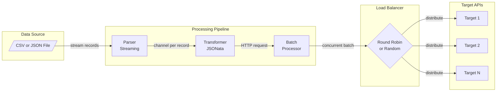
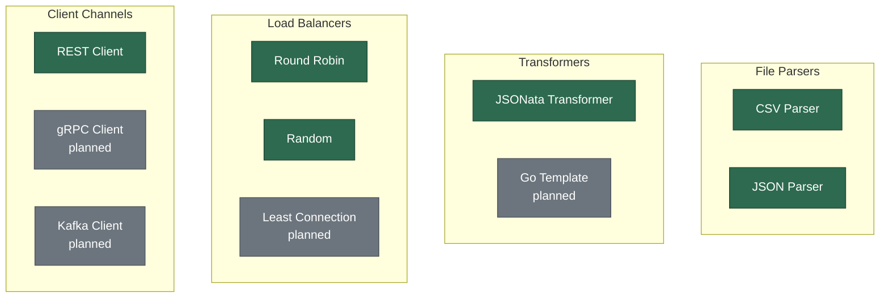

# Bombardment

> A lightweight, extensible tool for bulk API testing and data migration with streaming processing, JSONata transformations, and real-time progress tracking.

[](https://github.com/Dhi13man/bombardment-runner/actions/workflows/ci.yml)
[](https://go.dev)
[](LICENSE)

## Features

- **Streaming file parsing** — CSV and JSON files processed via Go channels, not loaded into memory
- **JSONata transformations** — Shape each record into an HTTP request using [JSONata](https://jsonata.org) expressions
- **Concurrent batch processing** — Configurable batch sizes with goroutine-per-request parallelism
- **Load balancing** — Round-robin and random strategies across multiple target URLs
- **Real-time progress** — REST API for job status with processed/failed/total counters
- **Web UI** — Guided wizard for configuring and monitoring bombardment jobs
- **CLI mode** — Full feature access from the command line for scripting and CI/CD
- **Response capture** — Optional CSV export of all API responses
- **Extensible architecture** — Strategy pattern makes it trivial to add new parsers, transformers, clients, and load balancers

## Architecture



Source files are streamed record-by-record through a parser, each record is transformed into an HTTP request via JSONata expressions, requests are grouped into configurable batches, and each batch is dispatched concurrently across load-balanced target URLs.

## Quick Start

### Prerequisites

- **Go 1.23+** (for building from source)
- **Docker** and **Docker Compose** (for containerized deployment)

### Docker (recommended)

```bash
docker compose up --build
# Visit http://localhost:8080
```

### From Source

```bash
git clone https://github.com/Dhi13man/bombardment-runner.git
cd bombardment-runner/app
go mod download
go run main.go server --bind-addr 0.0.0.0
# Visit http://localhost:8080
```

### CLI Mode

```bash
cd bombardment-runner/app
go run main.go cli \
  --client-context '{"channel":"REST","dial_timeout":5000000000,"request_timeout":30000000000}' \
  --driver-context '{"batch_size":100}' \
  --parser-context '{"strategy":"CSV","file_path":"./data.csv"}' \
  --load-balancer-context '{"strategy":"ROUND_ROBIN","urls":["https://api.example.com"]}' \
  --transformer-context '{"strategy":"JSONATA","method_expression":"\"POST\"","endpoint_expression":"\"/api/v1/users\"","body_expression":"{ \"name\": name, \"email\": email }"}'
```

## API Reference

| Endpoint | Method | Description |
| -------- | ------ | ----------- |
| `/v1/bombardment` | `POST` | Start a new bombardment job |
| `/v1/bombardment` | `GET` | List all jobs with status |
| `/v1/bombardment/{id}` | `GET` | Get job status and progress |
| `/v1/ping` | `GET` | Health check (returns `{"message": "pong"}`) |
| `/swagger/*any` | `GET` | Interactive Swagger API documentation |
| `/` | `GET` | Web UI |

For detailed schema documentation, start the server and visit `/swagger/index.html`.

## Configuration

The `POST /v1/bombardment` payload accepts these configuration sections:

| Section | Key Fields | Description |
| ------- | ---------- | ----------- |
| `parser_context` | `strategy`, `file_path`, `file_content_b64` | Source data format (`CSV`, `JSON`) and location (file path or base64-encoded content) |
| `transformer_context` | `strategy`, `method_expression`, `endpoint_expression`, `headers_expression`, `body_expression` | How to transform each record into an HTTP request using JSONata expressions |
| `client_context` | `channel`, `dial_timeout`, `request_timeout`, `insecure_skip_verify` | HTTP client channel and timeout settings (values in nanoseconds) |
| `load_balancer_context` | `strategy`, `urls` | Load balancing strategy (`ROUND_ROBIN`, `RANDOM`) and target endpoint URLs |
| `driver_context` | `batch_size`, `should_store_responses`, `responses_storage_path` | Batch processing size and optional response storage configuration |

### Example Request Body

```json
{
  "client_context": {
    "channel": "REST",
    "dial_timeout": 5000000000,
    "request_timeout": 30000000000,
    "insecure_skip_verify": false
  },
  "driver_context": {
    "batch_size": 100,
    "should_store_responses": true,
    "responses_storage_path": "./responses"
  },
  "parser_context": {
    "strategy": "CSV",
    "file_path": "./data.csv"
  },
  "load_balancer_context": {
    "strategy": "ROUND_ROBIN",
    "urls": ["https://api.example.com", "https://api-backup.example.com"]
  },
  "transformer_context": {
    "strategy": "JSONATA",
    "method_expression": "\"POST\"",
    "endpoint_expression": "\"/api/v1/users\"",
    "headers_expression": "{ \"Content-Type\": \"application/json\" }",
    "body_expression": "{ \"name\": name, \"email\": email }"
  }
}
```

## Development

```bash
make help          # Show all available targets
make build         # Build the binary
make test          # Run tests with race detector
make test-cover    # Run tests with coverage report
make lint          # Run golangci-lint
make run           # Start the server
make docker        # Build Docker image
make docker-run    # Run via Docker Compose
make swagger       # Regenerate Swagger docs
make clean         # Remove build artifacts
```

## Extending Bombardment

Bombardment uses the strategy pattern throughout. To add support for a new protocol, format, or algorithm:

1. **New file parser** — Implement `BaseFileParser[T]`, add an enum value to `ParserStrategy`, and register it in `CreateFileParser()`
2. **New transformer** — Implement `BaseTransformer`, add an enum value to `TransformerStrategy`, and register it in `CreateTransformer()`
3. **New load balancer** — Implement `BaseLoadBalancer`, add an enum value to `LoadBalancerStrategy`, and register it in `CreateLoadBalancer()`
4. **New client channel** — Implement `BaseChannelClient`, add an enum value to `ClientChannel`, and register it in `CreateChannelClient()`

See [CONTRIBUTING.md](CONTRIBUTING.md) for the full extension guide.

### Implemented Strategies



### Project Layout

```text
app/
├── main.go                          # Entrypoint (Cobra CLI + Gin server)
├── src/
│   ├── app/
│   │   ├── bootstrap/               # Server and CLI bootstrap
│   │   ├── cli/                     # Cobra CLI command definitions
│   │   ├── controllers/             # Gin HTTP controllers
│   │   └── ui/                      # Web UI (HTML, CSS, JS)
│   ├── models/
│   │   ├── dto/                     # Data transfer objects (request/response payloads)
│   │   ├── entities/                # Database entities (Bun ORM)
│   │   └── enums/                   # Strategy and channel enumerations
│   ├── repositories/                # Data access layer
│   └── services/
│       ├── batching/                # Batch processing orchestration
│       ├── clients/                 # HTTP client implementations
│       ├── driver/                  # Bombardment driver (main orchestrator)
│       ├── load_balancing/          # Load balancer strategies
│       ├── parsing/                 # File parser strategies
│       └── transforming/            # Data transformer strategies
└── docs/                            # Generated Swagger documentation
```

## License

MIT — see [LICENSE](LICENSE) for details.
