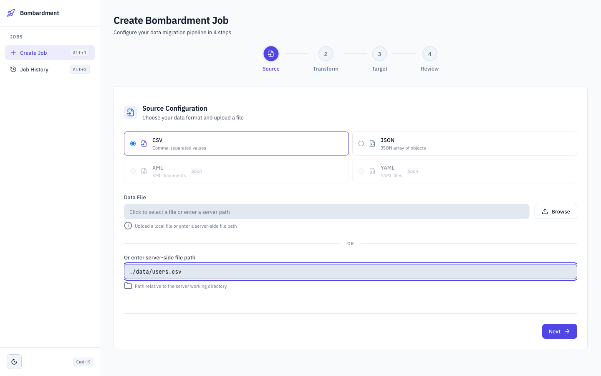
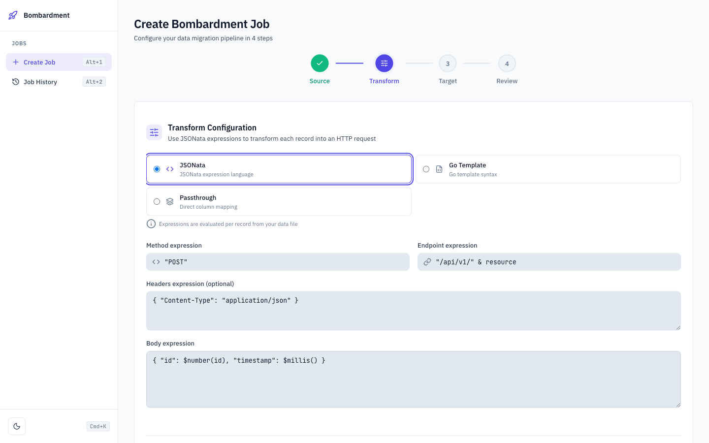
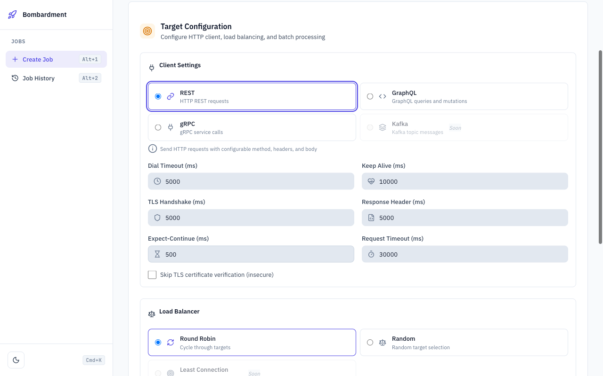
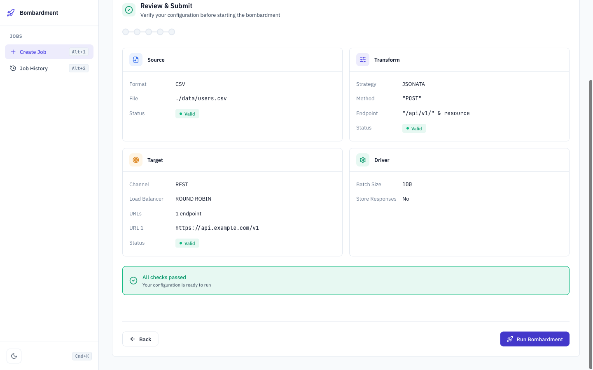
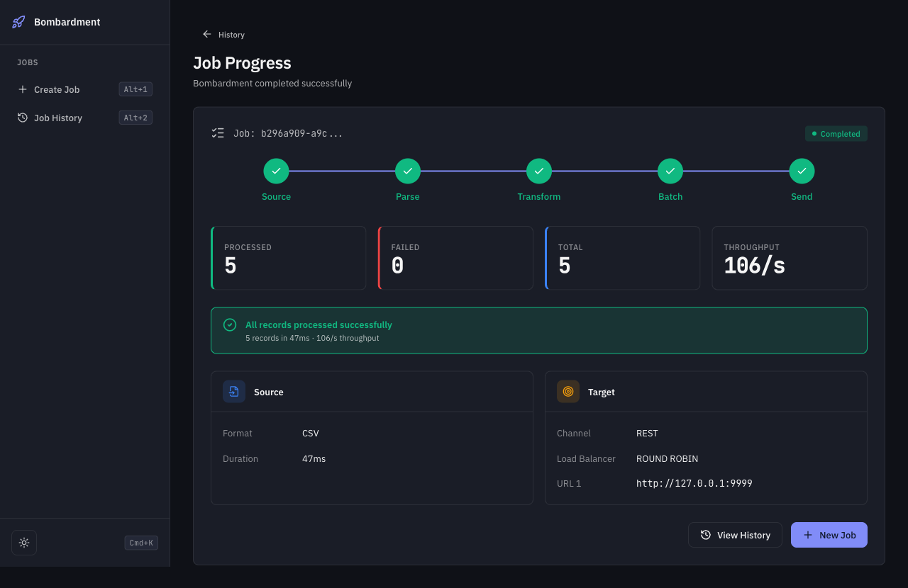
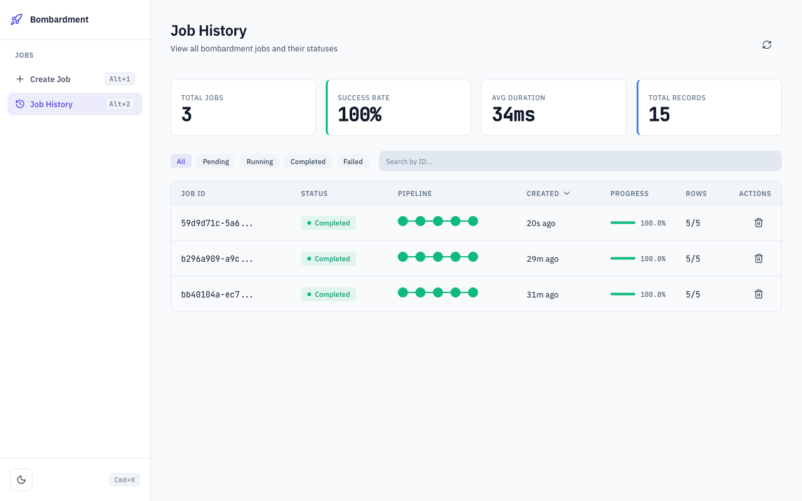
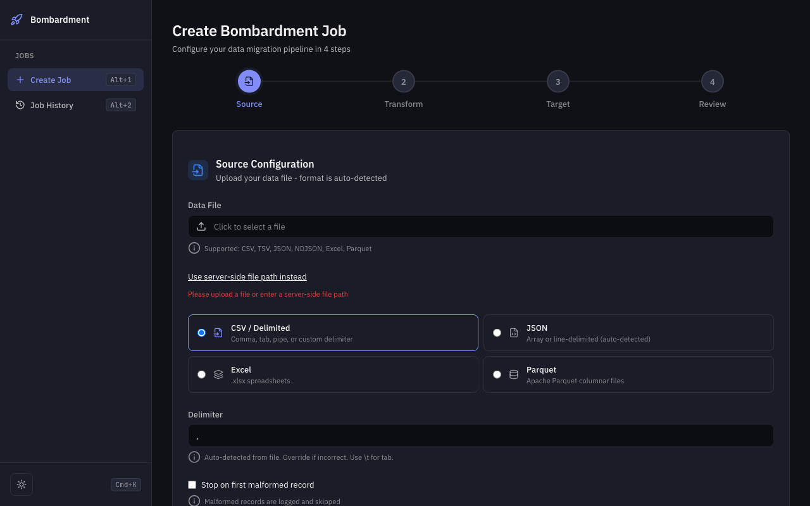
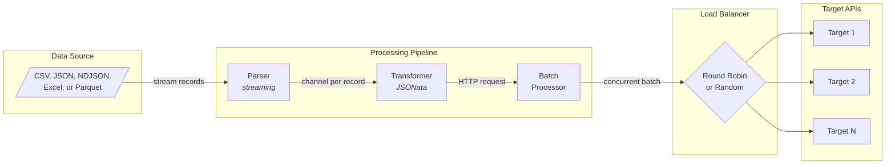
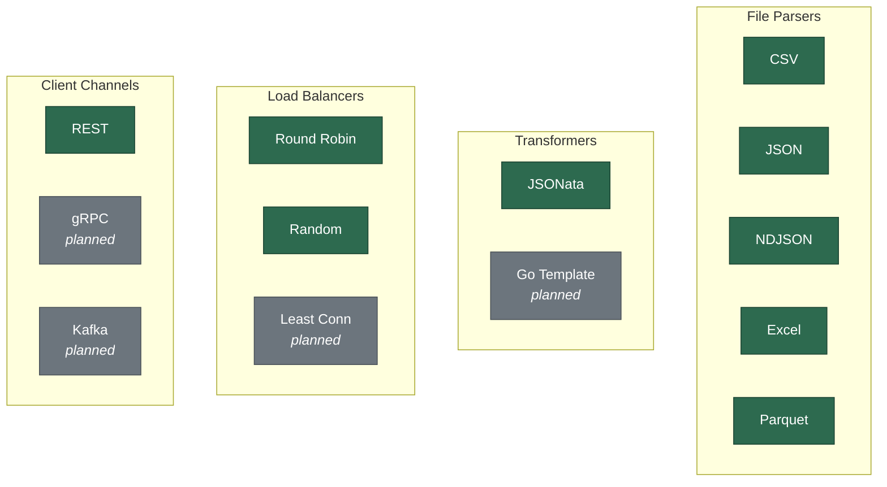

<p align="center">
  <strong>Bombardment</strong><br>
  <em>Stop writing throwaway scripts. Stream, transform, and dispatch millions of API requests from local files.</em>
</p>

<p align="center">
  <a href="https://bombardment.work">Website</a> &middot;
  <a href="https://github.com/Dhi13man/bombardment-runner/releases">Download</a> &middot;
  <a href="#quick-start">Quick Start</a> &middot;
  <a href="#api-reference">API Docs</a>
</p>

<p align="center">
  <a href="https://github.com/Dhi13man/bombardment-runner/releases"></a>
  <a href="https://github.com/Dhi13man/bombardment-runner/actions/workflows/ci.yml"></a>
  <a href="https://github.com/Dhi13man/bombardment-runner/blob/main/LICENSE"></a>
  <a href="https://go.dev"></a>
  <a href="https://github.com/Dhi13man/bombardment-runner/stargazers"></a>
</p>

---

Bombardment is a lightweight, extensible tool for bulk API testing and data migration. It streams records from CSV/JSON files, transforms them via JSONata expressions, batches them, and dispatches HTTP requests concurrently across load-balanced targets. It runs as both a Gin HTTP server (with Web UI) and a Cobra CLI.

## Features

- **Streaming file parsing** via Go channels for CSV, JSON, NDJSON, Excel, and Parquet (never loads full files into memory)
- **JSONata transformations** to reshape each record into an HTTP request (method, endpoint, headers, body)
- **Concurrent batch processing** with configurable batch sizes and goroutine-per-request parallelism (54K+ req/s sustained; see [Benchmarks](#benchmarks))
- **Client-side load balancing** with Round Robin and Random strategies across multiple targets
- **Dual interface**: guided Web UI wizard + CLI for scripting and CI/CD
- **Real-time job tracking** with processed/failed/total counters and throughput metrics
- **Response capture** with optional CSV export of status codes, timestamps, and latencies
- **Extensible architecture** via strategy pattern for parsers, transformers, clients, and load balancers

## Web UI

A guided 4-step wizard for configuring and monitoring jobs, no code required.

| Source Configuration | Transform Rules | Target & Batching | Review & Submit |
| --- | --- | --- | --- |
|  |  |  |  |

| Job Progress | Job History |
| --- | --- |
|  |  |

<details>
<summary>Dark mode</summary>



</details>

## Architecture



Source files are streamed record-by-record through a parser, each record is transformed into an HTTP request via JSONata, requests are grouped into configurable batches, and each batch is dispatched concurrently across load-balanced target URLs.

## Quick Start

### Download a binary

Grab the latest release for your platform from [GitHub Releases](https://github.com/Dhi13man/bombardment-runner/releases):

```bash
# Example: Linux x86_64
curl -L https://github.com/Dhi13man/bombardment-runner/releases/latest/download/bombardment-linux-amd64.tar.gz | tar xz
./bombardment-linux-amd64 server
# Open http://localhost:8080
```

| Platform | Architecture | Binary |
| --- | --- | --- |
| Linux | x86_64 | `bombardment-linux-amd64` |
| Linux | ARM64 | `bombardment-linux-arm64` |
| macOS | Intel | `bombardment-darwin-amd64` |
| macOS | Apple Silicon | `bombardment-darwin-arm64` |
| Windows | x86_64 | `bombardment-windows-amd64.exe` |
| Windows | ARM64 | `bombardment-windows-arm64.exe` |

### Docker

```bash
git clone https://github.com/Dhi13man/bombardment-runner.git
cd bombardment-runner
docker compose up --build
# Open http://localhost:8080
```

### From source

Requires Go 1.25+ and Node.js (for the Web UI frontend build).

```bash
git clone https://github.com/Dhi13man/bombardment-runner.git
cd bombardment-runner
make build
./app/bombardment server
# Open http://localhost:8080
```

### CLI mode

```bash
bombardment cli \
  --parser-context '{"strategy":"CSV","file_path":"./data.csv"}' \
  --transformer-context '{"strategy":"JSONATA","method_expression":"\"POST\"","endpoint_expression":"\"/api/v1/users\"","body_expression":"{ \"name\": name, \"email\": email }"}' \
  --load-balancer-context '{"strategy":"ROUND_ROBIN","urls":["https://api.example.com"]}' \
  --client-context '{"channel":"REST","request_timeout":30000000000}' \
  --driver-context '{"batch_size":100}'
```

## API Reference

| Endpoint | Method | Description |
| --- | --- | --- |
| `/v1/bombardment` | `POST` | Start a new bombardment job |
| `/v1/bombardment` | `GET` | List all jobs with status |
| `/v1/bombardment/{id}` | `GET` | Get job status and progress |
| `/v1/ping` | `GET` | Health check |
| `/swagger/*any` | `GET` | Interactive Swagger documentation |
| `/` | `GET` | Web UI |

Start the server and visit `/swagger/index.html` for full schema documentation.

## Configuration

The `POST /v1/bombardment` payload accepts these sections:

| Section | Key Fields | Description |
| --- | --- | --- |
| `parser_context` | `strategy`, `file_path`, `file_content_b64` | Source format (`CSV`, `JSON`, `NDJSON`, `EXCEL`, `PARQUET`) and location |
| `transformer_context` | `strategy`, `body_expression`, `method_expression`, `endpoint_expression`, `headers_expression` | JSONata expressions to shape each record into an HTTP request |
| `client_context` | `channel`, `request_timeout`, `insecure_skip_verify` | HTTP client settings (timeouts in nanoseconds) |
| `load_balancer_context` | `strategy`, `urls` | Load balancing strategy (`ROUND_ROBIN`, `RANDOM`) and target URLs |
| `driver_context` | `batch_size`, `should_store_responses`, `responses_storage_path` | Batch size and optional response CSV storage |

<details>
<summary>Example request body</summary>

```json
{
  "client_context": {
    "channel": "REST",
    "request_timeout": 30000000000
  },
  "driver_context": {
    "batch_size": 100,
    "should_store_responses": true,
    "responses_storage_path": "./responses"
  },
  "parser_context": {
    "strategy": "CSV",
    "file_path": "./data.csv"
  },
  "load_balancer_context": {
    "strategy": "ROUND_ROBIN",
    "urls": ["https://api.example.com", "https://api-backup.example.com"]
  },
  "transformer_context": {
    "strategy": "JSONATA",
    "method_expression": "\"POST\"",
    "endpoint_expression": "\"/api/v1/users\"",
    "headers_expression": "{ \"Content-Type\": \"application/json\" }",
    "body_expression": "{ \"name\": name, \"email\": email }"
  }
}
```

</details>

## Benchmarks

All benchmarks run on Apple M3 Pro (macOS, Go 1.25), batch_size=100, JSONata transformer, REST client. Mock server: `go run ./bench`.

### Parser throughput (100K rows, 1 target)

| Parser | Duration | Throughput |
| --- | --- | --- |
| CSV | 2.6s | ~37.5K req/s |
| JSON | 2.2s | ~45.8K req/s |
| NDJSON | 2.2s | ~45.1K req/s |

### Load balancer (100K rows, CSV, 2 targets)

| Strategy | Duration | Combined throughput | Distribution |
| --- | --- | --- | --- |
| Round Robin | 2.5s | ~39K req/s | 50/50 exact |
| Random | 2.2s | ~45K req/s | ~50/50 |

### Scale (1M rows)

| Config | Duration | Throughput |
| --- | --- | --- |
| CSV, 1 target | 18s | ~54K req/s |
| NDJSON, 2 targets | 19s | ~51K req/s |

Zero failures across all runs. Full methodology and reproduction steps in [`bench/README.md`](bench/README.md).

## Development

```bash
make help          # Show all available targets
make build         # Build frontend + Go binary
make test          # Run tests with race detector
make test-cover    # Tests + coverage report
make lint          # golangci-lint
make run           # Start the server (localhost:8080)
make swagger       # Regenerate Swagger docs
make clean         # Remove build artifacts
```

Run a single test:

```bash
cd app && go test -v -race -run TestFunctionName ./src/services/path/...
```

## Extending Bombardment

Every pipeline stage uses the same strategy pattern:

1. Implement the `Base*` interface
2. Add an enum value in `models/enums/`
3. Register it in the `Create*()` factory function



### Project layout

```text
app/
  main.go                          Entrypoint (Cobra CLI + Gin server)
  src/
    app/
      bootstrap/                   Server and CLI bootstrap
      cli/                         Cobra CLI commands
      controllers/                 Gin HTTP controllers
      ui/                          Web UI (HTML, CSS, JS)
    models/
      dto/                         Request/response payloads
      entities/                    Database entities (Bun ORM)
      enums/                       Strategy enumerations
    services/
      batching/                    Batch processing orchestration
      clients/                     HTTP client implementations
      driver/                      Main pipeline orchestrator
      load_balancing/              Load balancer strategies
      parsing/                     File parser strategies
      transforming/                Data transformer strategies
  docs/                            Generated Swagger documentation
landing-site/                      Static landing page (bombardment.work)
```

See [CONTRIBUTING.md](CONTRIBUTING.md) for the full extension guide.

## Contributing

Contributions are welcome. Check the [Contributing Guide](CONTRIBUTING.md) for exact steps.

- File [issues or feature requests](https://github.com/Dhi13man/bombardment-runner/issues), or help resolve existing ones
- This project follows the [Contributor Covenant v2.1](CODE_OF_CONDUCT.md)

## Changelog

See [CHANGELOG.md](CHANGELOG.md) for version history.

## License

MIT. See [LICENSE](LICENSE) for details.

---

<p align="center">
  <a href="https://bombardment.work">bombardment.work</a> &middot;
  Built by <a href="https://github.com/Dhi13man">Dhiman Seal</a>
</p>

[](https://www.buymeacoffee.com/dhi13man)
