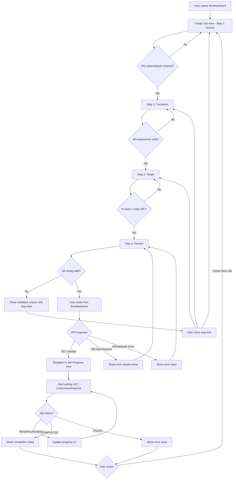
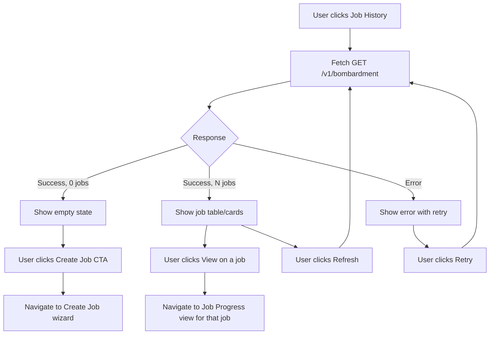
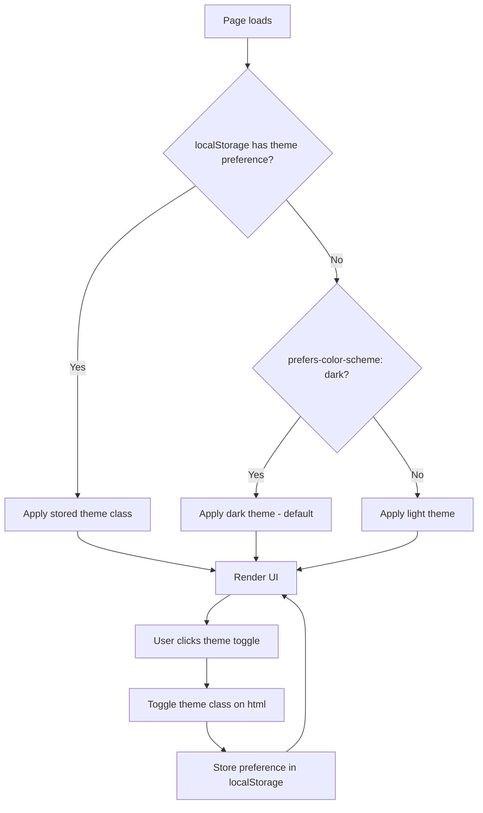

# Bombardment UI/UX Specification

Complete frontend design specification for the Bombardment redesign: dark/cyan professional developer tool aesthetic.

---

## Table of Contents

1. [Design Analysis & Decisions](#1-design-analysis--decisions)
2. [Information Architecture](#2-information-architecture)
3. [Global Layout & Navigation](#3-global-layout--navigation)
4. [Page 1: Create Job Wizard](#4-page-1-create-job-wizard)
5. [Page 2: Job Progress View](#5-page-2-job-progress-view)
6. [Page 3: Job History View](#6-page-3-job-history-view)
7. [Component Specifications](#7-component-specifications)
8. [Responsive Behavior](#8-responsive-behavior)
9. [Micro-interactions](#9-micro-interactions)
10. [Error States Catalog](#10-error-states-catalog)
11. [Accessibility Specification](#11-accessibility-specification)
12. [Implementation Notes](#12-implementation-notes)

---

## 1. Design Analysis & Decisions

### 1.1 Current State Assessment

| Problem | Evidence | Severity |
| ------- | -------- | -------- |
| Consumer aesthetic misaligned with developer audience | Orange gradient, FontAwesome icons, Animate.css bounce/float effects | High |
| Step 3 (Target) is cognitively overloaded | Client settings (8 fields) + Load Balancer settings (strategy + dynamic URL list) on one step | High |
| Six timeout fields shown without progressive disclosure | All timeouts visible by default; most users use defaults | Medium |
| Expression fields lack code-editing affordance | Standard text inputs with no monospace, no syntax hints, no dark background | Medium |
| No theme toggle or dark mode despite developer audience | Light-only, consumer SaaS feel | Medium |
| FontAwesome loaded as blocking JS | Render-blocking script in `<head>`, ~100KB for a handful of icons | Low |
| Animate.css loaded for 2-3 simple fade animations | Entire library for `fadeIn`, `fadeInUp` only | Low |

### 1.2 Design Decisions

| # | Decision | Rationale | Alternative Considered |
| - | -------- | --------- | --------------------- |
| 1 | Keep 4-step wizard, do NOT split Target into 2 steps | Splitting creates a 5th step that makes the process feel longer than it is. The density problem is solved by progressive disclosure on timeout fields, not by adding steps. 4 steps maps cleanly to the 4 API context objects (parser, transformer, client+lb, driver). | 5-step wizard (rejected: adds perceived complexity without reducing actual complexity) |
| 2 | Progressive disclosure on timeout fields via collapsible "Advanced" section | 6 timeout fields are expert settings. Default values are sensible. Showing them increases perceived complexity for 90%+ of users. | Separate "Advanced" tab (rejected: context-switching), tooltip-only (rejected: not discoverable enough) |
| 3 | Monospace dark-inset inputs for expression fields | Expressions are code. Code inputs should look like code: dark background, monospace font, distinct from regular text inputs. This is the strongest affordance available without a full code editor. | CodeMirror/Monaco editor (rejected: too heavy for vanilla JS, future enhancement), regular inputs (rejected: no code affordance) |
| 4 | Lucide inline SVGs replacing FontAwesome | Eliminates render-blocking JS dependency. Lucide icons are MIT, tree-shakeable, and match the clinical aesthetic. Inline SVGs are cacheable, style-able via CSS, and load instantly. | Heroicons (equally valid, Lucide has slightly more icons relevant to dev tools), keeping FontAwesome (rejected: performance) |
| 5 | CSS transitions replacing Animate.css | Only 3 animation patterns needed (fade-in, slide-up, progress-fill). 50 bytes of CSS vs 80KB library. Transitions at 150ms match the snappy developer tool feel. | Keep Animate.css (rejected: bloat), no animations (rejected: too abrupt) |
| 6 | Dark-first with light mode toggle | Developer tools are overwhelmingly dark-mode. Matches Linear/Raycast/Warp/Hoppscotch inspiration. Light mode available via toggle for accessibility and preference. | Light-first with dark toggle (rejected: misaligned with target audience), dark-only (rejected: accessibility) |
| 7 | Glass morphism for cards, flat for inputs | Glass surfaces (backdrop-blur + translucent backgrounds) create depth hierarchy without shadows. Inputs stay flat/opaque for readability and data entry clarity. | Pure flat (Linear-style, rejected: too stark for a tool with this much configuration), full glassmorphism (rejected: readability issues on inputs) |
| 8 | Auto-poll job progress at 2s intervals | Jobs can run for seconds to minutes. 2s balances responsiveness vs server load. Poll interval increases to 5s after 30s, 10s after 2min. Stops on terminal state. | WebSocket (rejected: added backend complexity for minimal gain), manual refresh only (rejected: poor UX for async operations) |
| 9 | Auto-navigate to progress view after job submission | The create form is done, the user's intent has shifted to monitoring. Keeping them on the form with a "success" message is dead-end UX. | Stay on form with success toast (rejected: dead-end), new page/route (rejected: SPA is single-file vanilla JS) |
| 10 | Job History uses table on desktop, card stack on mobile | Tables are scannable and information-dense for job lists. But tables break on mobile, so cards provide the same data in a vertical layout. | Cards everywhere (rejected: wastes desktop space), table with horizontal scroll (rejected: frustrating on mobile) |

---

## 2. Information Architecture

### 2.1 Sitemap

```
Bombardment App
|
+-- Sidebar Navigation (persistent)
|   +-- Logo + App Name
|   +-- Create Job (active by default)
|   +-- Job History
|   +-- Theme Toggle (footer)
|
+-- Create Job Wizard
|   +-- Step 1: Source (Parser)
|   +-- Step 2: Transform (Transformer)
|   +-- Step 3: Target (Client + Load Balancer)
|   +-- Step 4: Review & Execute (Driver + Summary)
|
+-- Job Progress View (replaces wizard after submission)
|
+-- Job History View (separate view)
    +-- Job List (table/cards)
    +-- Click-to-expand or view individual job progress
```

### 2.2 Wizard Step-to-API Mapping

| Wizard Step | API Context Object | Fields |
| ----------- | ------------------ | ------ |
| Step 1: Source | `parser_context` | `strategy` (CSV/JSON), `file_path`, `file_content_b64` |
| Step 2: Transform | `transformer_context` | `strategy` (JSONATA/GOTEMPLATE), `body_expression`, `endpoint_expression`, `headers_expression`, `method_expression` |
| Step 3: Target | `client_context` + `load_balancer_context` | Client: `channel`, 6 timeouts, `insecure_skip_verify`. LB: `strategy`, `urls[]` |
| Step 4: Review | `driver_context` + summary | `batch_size`, `should_store_responses`, `responses_storage_path` |

### 2.3 Navigation Model

- **Primary navigation**: Sidebar with 2 items (Create Job, Job History)
- **Secondary navigation**: Wizard step indicator (within Create Job)
- **Contextual navigation**: Back/Next buttons within wizard, New Job button on progress view
- **No deep linking needed**: SPA with view-switching, no URL routing (vanilla JS constraint)

---

## 3. Global Layout & Navigation

### 3.1 Application Shell

```
+-------------------------------------------------------+
|                                                       |
| +----------+ +--------------------------------------+ |
| |          | |                                      | |
| | SIDEBAR  | |         MAIN CONTENT                 | |
| | (240px)  | |         (flex-1)                     | |
| |          | |                                      | |
| | Logo     | |  [Page Header]                       | |
| | -------- | |                                      | |
| | Nav      | |  [Step Indicator] (wizard only)       | |
| | Items    | |                                      | |
| |          | |  [Content Area]                       | |
| |          | |                                      | |
| |          | |                                      | |
| | -------- | |                                      | |
| | Theme    | |                                      | |
| | Toggle   | |                                      | |
| +----------+ +--------------------------------------+ |
|                                                       |
+-------------------------------------------------------+
```

### 3.2 Sidebar Specification

**Component**: `Sidebar`

| Property | Value | Notes |
| -------- | ----- | ----- |
| Width (expanded) | 240px | Fixed position, full height |
| Width (collapsed) | 56px | Icon-only mode |
| Background | `rgba(15, 23, 42, 0.6)` + `backdrop-filter: blur(16px)` | Glass surface |
| Border-right | `1px solid rgba(6, 182, 212, 0.1)` | Subtle cyan tint |
| Z-index | 30 | Above main content |
| Transition | 200ms `cubic-bezier(0.4, 0, 0.2, 1)` | Width animation |

**Content structure**:

```
Sidebar
+-- Header (py-6, px-4)
|   +-- Logo SVG (24x24, cyan accent)
|   +-- App Name "Bombardment" (IBM Plex Sans, 600, 16px)
|   +-- Collapse Toggle Button (icon-only, right-aligned)
|
+-- Navigation (py-2)
|   +-- Section Label "JOBS" (10px, uppercase, letter-spacing 0.1em, text-muted)
|   +-- NavItem: "Create Job" (icon: plus-circle)
|   +-- NavItem: "Job History" (icon: clock)
|
+-- Footer (mt-auto, py-4, px-4)
    +-- Theme Toggle (sun/moon icon button)
    +-- Version text (12px, muted)
```

**NavItem states**:

| State | Background | Text | Border-left |
| ----- | ---------- | ---- | ----------- |
| Default | transparent | `rgba(255,255,255,0.6)` | none |
| Hover | `rgba(6, 182, 212, 0.08)` | `rgba(255,255,255,0.85)` | none |
| Active | `rgba(6, 182, 212, 0.12)` | `#06B6D4` (cyan) | `2px solid #06B6D4` |
| Focus-visible | transparent | `rgba(255,255,255,0.85)` | `2px solid #06B6D4` + focus ring |

**Collapse behavior**:

- Toggle button (chevron icon) in header
- Collapsed: 56px width, only icons visible, tooltip on hover showing label
- Labels animate with `opacity` and `max-width` (not display:none, for smooth transition)
- On mobile (<768px): sidebar becomes overlay with semi-transparent backdrop

**Mobile overlay**:

- Hamburger button in top-left of main content header
- Sidebar slides in from left with 240px width
- Backdrop: `rgba(0, 0, 0, 0.5)`, click-to-dismiss
- Backdrop `z-index: 29`, sidebar `z-index: 30`

### 3.3 Main Content Area

| Property | Value |
| -------- | ----- |
| Margin-left | 240px (expanded sidebar) / 56px (collapsed) |
| Max-width | 960px (content within, centered) |
| Padding | 32px (desktop), 16px (mobile) |
| Background | `#0F172A` (slate-900 base) |
| Min-height | `100dvh` |

### 3.4 Page Header

Each view has a header section (no gradient, flat design):

```
[Page Header]
+-- Page Title (h1, 24px, IBM Plex Sans, 600, white)
+-- Page Description (14px, text-secondary, max-width 480px)
```

No gradient banners, no decorative icons with animations. Clean, minimal, information-first.

---

## 4. Page 1: Create Job Wizard

### 4.1 Step Indicator

Replaces the current arrow/chevron step indicator with a minimal horizontal stepper.

```
Step Indicator (horizontal, full-width)
+-------------------------------------------------------------------+
|  (1) Source  --------  (2) Transform  --------  (3) Target  --------  (4) Review  |
+-------------------------------------------------------------------+
```

**Structure per step**:

```
StepItem
+-- Step Number Circle (24px diameter)
|   +-- Number text (12px, JetBrains Mono, centered)
+-- Step Label (14px, IBM Plex Sans, 500)
+-- Connector Line (between steps, 2px height)
```

**Step states**:

| State | Circle BG | Circle Border | Circle Text | Label | Connector |
| ----- | --------- | ------------- | ----------- | ----- | --------- |
| Upcoming | transparent | `rgba(255,255,255,0.15)` | `rgba(255,255,255,0.4)` | `rgba(255,255,255,0.4)` | `rgba(255,255,255,0.1)` |
| Active | `rgba(6, 182, 212, 0.15)` | `#06B6D4` | `#06B6D4` | `#06B6D4` (font-weight 600) | `rgba(255,255,255,0.1)` (right side) |
| Completed | `#06B6D4` | `#06B6D4` | `#0F172A` (check icon replaces number) | `rgba(255,255,255,0.7)` | `#06B6D4` |

**Connector behavior**: Fills left-to-right as steps complete. Active step's left connector is filled, right connector is unfilled.

**Accessibility**:

- `role="list"` on container, `role="listitem"` on each step
- `aria-current="step"` on active step
- `aria-label="Step N of 4: {Label}"` on each step
- Steps are NOT clickable (wizard enforces linear progression for data integrity)

**Mobile (< 640px)**:

- Labels hidden, only numbered circles with connectors
- Step label appears below the active circle only

### 4.2 Step 1: Source Configuration

**Component tree**:

```
StepContent[data-step="1"]
+-- SectionHeader
|   +-- Icon (file-text, 20px, in 36px circle, cyan bg/icon)
|   +-- Title "Source Configuration" (18px, 600)
|   +-- Description "Select your data format and upload the source file" (14px, muted)
|
+-- FieldGroup: Parser Strategy
|   +-- Label "Format" (14px, 500, with required asterisk)
|   +-- RadioCardGroup (horizontal, gap-12px)
|       +-- RadioCard "CSV"
|       |   +-- Icon (file-spreadsheet, 20px)
|       |   +-- Label "CSV" (14px, 600)
|       |   +-- Description "Comma-separated values" (12px, muted)
|       +-- RadioCard "JSON"
|           +-- Icon (braces, 20px)
|           +-- Label "JSON" (14px, 600)
|           +-- Description "JavaScript Object Notation" (12px, muted)
|
+-- FieldGroup: File Upload
    +-- Label "Source File" (14px, 500, with required asterisk)
    +-- FileUploadZone
    |   +-- DropZone (dashed border, 120px height)
    |   |   +-- Icon (upload-cloud, 32px, muted)
    |   |   +-- Text "Drop file here or click to browse" (14px, muted)
    |   |   +-- Accepted formats text "CSV, JSON" (12px, muted)
    |   +-- FileInfo (shown after selection)
    |       +-- File icon + name + size
    |       +-- Remove button (x icon)
    +-- Divider with "or" text
    +-- Input: Server Path
        +-- Label "Server file path" (12px, muted)
        +-- TextInput with placeholder "./data.csv"
        +-- HelpText "Path to a file accessible by the server" (12px, muted)
```

**RadioCard specification**:

| Property | Unselected | Selected | Disabled |
| -------- | ---------- | -------- | -------- |
| Background | `rgba(255,255,255,0.03)` | `rgba(6, 182, 212, 0.08)` | `rgba(255,255,255,0.02)` |
| Border | `1px solid rgba(255,255,255,0.1)` | `1px solid rgba(6, 182, 212, 0.4)` | `1px solid rgba(255,255,255,0.05)` |
| Radius | 8px | 8px | 8px |
| Padding | 16px | 16px | 16px |
| Icon color | `rgba(255,255,255,0.5)` | `#06B6D4` | `rgba(255,255,255,0.2)` |
| Label color | `rgba(255,255,255,0.7)` | `#FFFFFF` | `rgba(255,255,255,0.3)` |
| Cursor | pointer | pointer | not-allowed |
| Min-width | 140px | 140px | 140px |
| Min-height | 80px | 80px | 80px |

**FileUploadZone specification**:

| State | Border | Background | Icon |
| ----- | ------ | ---------- | ---- |
| Default | `2px dashed rgba(255,255,255,0.1)` | transparent | muted |
| Hover | `2px dashed rgba(6, 182, 212, 0.3)` | `rgba(6, 182, 212, 0.04)` | cyan-tinted |
| Drag-over | `2px dashed #06B6D4` | `rgba(6, 182, 212, 0.08)` | cyan |
| File loaded | `1px solid rgba(6, 182, 212, 0.2)` | `rgba(6, 182, 212, 0.05)` | file icon |
| Error | `2px dashed rgba(239, 68, 68, 0.4)` | `rgba(239, 68, 68, 0.05)` | red |

### 4.3 Step 2: Transform Configuration

**Component tree**:

```
StepContent[data-step="2"]
+-- SectionHeader
|   +-- Icon (shuffle, 20px, in 36px circle, violet bg/icon)
|   +-- Title "Transform Configuration" (18px, 600)
|   +-- Description "Define how source data maps to HTTP requests" (14px, muted)
|
+-- FieldGroup: Strategy
|   +-- Label "Strategy" (14px, 500, required)
|   +-- Select (dropdown)
|       +-- Option "JSONata" (default)
|       +-- Option "Go Template"
|
+-- FieldGroup: Method Expression
|   +-- Label "HTTP Method" (14px, 500, required)
|   +-- CodeInput (single-line, monospace)
|   |   +-- Default value: '"POST"'
|   +-- HelpText with link "JSONata expression that resolves to HTTP method"
|
+-- FieldGroup: Endpoint Expression
|   +-- Label "Endpoint" (14px, 500, required)
|   +-- CodeInput (single-line, monospace)
|   |   +-- Default value: '"/api/v1/" & resource'
|   +-- HelpText "Expression that resolves to request URL path"
|
+-- FieldGroup: Headers Expression
|   +-- Label "Headers" (14px, 500, required)
|   +-- CodeInput (multi-line, 3 rows, monospace)
|   |   +-- Default value: '{ "Content-Type": "application/json" }'
|   +-- HelpText "Expression that resolves to a headers object"
|
+-- FieldGroup: Body Expression
|   +-- Label "Body" (14px, 500, required)
|   +-- CodeInput (multi-line, 5 rows, monospace)
|   |   +-- Default value: '{ "id": $number(id), "timestamp": $millis() }'
|   +-- HelpText "Expression that resolves to request body"
|
+-- InfoBanner (strategy-contextual)
    +-- Icon (info, 16px)
    +-- Text changes based on strategy selection
    +-- Link to external docs
```

**CodeInput specification** (the key design innovation for expressions):

| Property | Value |
| -------- | ----- |
| Background | `#1E293B` (slate-800, darker than page background) |
| Border | `1px solid rgba(255,255,255,0.08)` |
| Border (focus) | `1px solid rgba(6, 182, 212, 0.5)` |
| Border-radius | 6px |
| Font-family | `'JetBrains Mono', ui-monospace, monospace` |
| Font-size | 13px |
| Line-height | 1.6 |
| Color | `#E2E8F0` (slate-200) |
| Padding | 12px 16px |
| Box-shadow (focus) | `0 0 0 3px rgba(6, 182, 212, 0.15)` |

Single-line CodeInput is an `<input type="text">`. Multi-line CodeInput is a `<textarea>`.

Both have:

- A small label badge in the top-right corner showing the syntax type ("JSONata" or "Go Template") in 10px monospace, `rgba(255,255,255,0.3)`, to reinforce what kind of expression is expected
- Tab key inserts 2 spaces (in textarea only, not in single-line)
- Placeholder text in `rgba(255,255,255,0.2)`

**Strategy info text mapping**:

| Strategy | Info Text |
| -------- | --------- |
| JSONATA | "Use JSONata expressions to transform your data. Docs: jsonata.org" |
| GOTEMPLATE | "Use Go template syntax. Docs: pkg.go.dev/text/template" |

### 4.4 Step 3: Target Configuration

**Component tree**:

```
StepContent[data-step="3"]
+-- SectionHeader
|   +-- Icon (target, 20px, in 36px circle, emerald bg/icon)
|   +-- Title "Target Configuration" (18px, 600)
|   +-- Description "Configure HTTP client and load balancing" (14px, muted)
|
+-- Card[variant="glass"]: Client Settings
|   +-- CardHeader
|   |   +-- Icon (plug, 16px)
|   |   +-- Title "Client" (16px, 500)
|   +-- CardBody
|       +-- FieldGroup: Channel
|       |   +-- Label "Channel" (14px, 500, required)
|       |   +-- RadioCardGroup (horizontal)
|       |       +-- RadioCard "REST" (enabled, default)
|       |       +-- RadioCard "gRPC" (disabled, "Coming soon" badge)
|       |       +-- RadioCard "Kafka" (disabled, "Coming soon" badge)
|       |
|       +-- AdvancedSection (collapsible, collapsed by default)
|       |   +-- Toggle Button "Advanced Timeouts" (chevron-down icon)
|       |   |   +-- Subtitle "6 fields, using sensible defaults" (12px, muted)
|       |   +-- CollapsibleContent
|       |       +-- Grid (2 columns on desktop, 1 on mobile)
|       |           +-- NumberInput: Dial Timeout (default: 5000ms)
|       |           +-- NumberInput: Keep Alive (default: 10000ms)
|       |           +-- NumberInput: TLS Handshake (default: 5000ms)
|       |           +-- NumberInput: Response Header (default: 5000ms)
|       |           +-- NumberInput: Expect-Continue (default: 500ms)
|       |           +-- NumberInput: Request Timeout (default: 30000ms)
|       |
|       +-- Checkbox: Skip TLS Verification
|           +-- Warning text "Only for development/testing" (12px, amber)
|
+-- Card[variant="glass"]: Load Balancer Settings
    +-- CardHeader
    |   +-- Icon (git-branch, 16px)
    |   +-- Title "Load Balancer" (16px, 500)
    +-- CardBody
        +-- FieldGroup: Strategy
        |   +-- Label "Strategy" (14px, 500, required)
        |   +-- RadioCardGroup (horizontal)
        |       +-- RadioCard "Round Robin" (default)
        |       +-- RadioCard "Random"
        |       +-- RadioCard "Least Connection" (disabled, "Coming soon" badge)
        |
        +-- FieldGroup: Target URLs
            +-- Label "URLs" (14px, 500, required)
            +-- DynamicList
            |   +-- URLInputRow (repeatable)
            |   |   +-- TextInput (URL, with http:// prefix hint)
            |   |   +-- RemoveButton (x icon, 44x44 touch target)
            |   +-- URLInputRow ...
            +-- AddButton "Add URL" (plus icon, ghost style)
            +-- ValidationMessage (aria-live="polite")
```

**AdvancedSection (Progressive Disclosure) specification**:

| State | Toggle Text | Chevron | Content |
| ----- | ----------- | ------- | ------- |
| Collapsed | "Advanced Timeouts (6 fields, using defaults)" | chevron-right | `max-height: 0; overflow: hidden` |
| Expanded | "Advanced Timeouts" | chevron-down | `max-height: auto` (animate with 200ms) |

The toggle is a `<button>` with:

- `aria-expanded="false"` / `"true"`
- `aria-controls="advanced-timeouts-content"`
- Full width, left-aligned text, subtle hover background
- Small muted count badge showing "6 fields" (helps user know what's hidden)

**DynamicList (URL management) specification**:

- Starts with 1 URL input row pre-populated empty
- "Add URL" button appends a new row (max 20 URLs)
- Remove button (x) removes the row (minimum 1 row must remain)
- Remove animation: row fades out + collapses height in 150ms
- Add animation: row expands height + fades in at 150ms
- Validation: each URL validated on blur, red border on invalid

### 4.5 Step 4: Review & Execute

**Component tree**:

```
StepContent[data-step="4"]
+-- SectionHeader
|   +-- Icon (check-circle, 20px, in 36px circle, cyan bg/icon)
|   +-- Title "Review & Execute" (18px, 600)
|   +-- Description "Verify your configuration and start the job" (14px, muted)
|
+-- ConfigSummaryGrid (2 columns on desktop, 1 on mobile)
|   +-- ConfigSummaryCard: Source
|   |   +-- CardHeader (icon: file-text, label: "Source")
|   |   +-- ConfigItem: Format -> "CSV" (badge)
|   |   +-- ConfigItem: File -> "data.csv" (truncated with tooltip)
|   |
|   +-- ConfigSummaryCard: Transform
|   |   +-- CardHeader (icon: shuffle, label: "Transform")
|   |   +-- ConfigItem: Strategy -> "JSONata" (badge)
|   |   +-- ConfigItem: Method -> '"POST"' (monospace)
|   |   +-- ConfigItem: Endpoint -> '"/api/v1/" & resource' (monospace, truncated)
|   |
|   +-- ConfigSummaryCard: Client
|   |   +-- CardHeader (icon: plug, label: "Client")
|   |   +-- ConfigItem: Channel -> "REST" (badge)
|   |   +-- ConfigItem: Timeouts -> "6 configured" (expandable detail)
|   |   +-- ConfigItem: TLS Skip -> "No" or "Yes (warning icon)"
|   |
|   +-- ConfigSummaryCard: Load Balancer
|       +-- CardHeader (icon: git-branch, label: "Load Balancer")
|       +-- ConfigItem: Strategy -> "Round Robin" (badge)
|       +-- ConfigItem: URLs -> "3 targets" (expandable list)
|
+-- Card[variant="glass"]: Execution Settings
|   +-- CardHeader
|   |   +-- Icon (settings, 16px)
|   |   +-- Title "Execution" (16px, 500)
|   +-- CardBody
|       +-- Grid (2 columns)
|           +-- NumberInput: Batch Size (default: 100, required)
|           +-- CheckboxField: Store Responses
|               +-- Conditional: TextInput for storage path (shown when checked)
|
+-- ValidationIssuesPanel (shown if issues exist)
|   +-- WarningBanner (amber border-left)
|   |   +-- Icon (alert-triangle)
|   |   +-- Count "N issues found"
|   |   +-- Toggle to expand/collapse
|   +-- IssueList
|       +-- IssueItem (per issue)
|           +-- Severity icon (error: red, warning: amber)
|           +-- Issue text
|           +-- "Go to step N" link
|
+-- ActionBar (sticky bottom on mobile)
    +-- Back Button (ghost variant)
    +-- Submit Button "Run Bombardment" (primary variant, cyan)
        +-- Icon (play)
        +-- Loading state: spinner + "Submitting..."
```

**ConfigSummaryCard specification**:

| Property | Value |
| -------- | ----- |
| Background | `rgba(255,255,255,0.03)` |
| Border | `1px solid rgba(255,255,255,0.06)` |
| Border-radius | 8px |
| Header background | `rgba(255,255,255,0.02)` |
| Header border-bottom | `1px solid rgba(255,255,255,0.06)` |
| Header padding | 12px 16px |
| Body padding | 4px 16px |

**ConfigItem specification**:

```
ConfigItem
+-- Label (40% width, 13px, text-muted, flex with icon)
+-- Value (60% width, 13px, text-primary or badge or monospace)
Border-bottom: 1px solid rgba(255,255,255,0.04) (except last)
Padding: 10px 0
Min-height: 40px (for touch targets)
```

### 4.6 Wizard Navigation Bar

Sticky at the bottom of the form card.

```
NavigationBar
+-- BackButton (ghost variant, hidden on Step 1)
|   +-- Icon (arrow-left) + "Back"
+-- Spacer
+-- StepCounter "Step N of 4" (12px, muted, center-aligned)
+-- NextButton (primary variant, hidden on Step 4)
|   +-- "Next" + Icon (arrow-right)
+-- SubmitButton (primary variant, shown only on Step 4)
    +-- Icon (play) + "Run Bombardment"
```

**Button states**:

| State | Background | Text | Border | Cursor |
| ----- | ---------- | ---- | ------ | ------ |
| Enabled | `#06B6D4` | `#0F172A` | none | pointer |
| Hover | `#0891B2` (darker cyan) | `#0F172A` | none | pointer |
| Active | `#0E7490` | `#0F172A` | none | pointer |
| Disabled | `rgba(6, 182, 212, 0.2)` | `rgba(255,255,255,0.3)` | none | not-allowed |
| Loading | `rgba(6, 182, 212, 0.6)` | `#0F172A` | none | wait |
| Focus-visible | `#06B6D4` | `#0F172A` | `2px solid white` offset 2px | pointer |

**Validation gating**: Next/Submit buttons are disabled until the current step validates. The disabled state shows a tooltip on hover: "Complete all required fields to continue".

---

## 5. Page 2: Job Progress View

Shown after successful job submission. Replaces the wizard content area (sidebar stays).

### 5.1 Component Tree

```
JobProgressView
+-- PageHeader
|   +-- BackLink "New Job" (ghost button with arrow-left, returns to wizard)
|   +-- Title "Job Progress" (24px, 600)
|
+-- Card[variant="glass"]: Job Info
|   +-- Row: Job ID + Status Badge
|   |   +-- Job ID (JetBrains Mono, 13px, truncated middle with copy button)
|   |   +-- StatusBadge (PENDING | RUNNING | COMPLETED | FAILED)
|   +-- Row: Created at (relative time, tooltip with absolute)
|
+-- ProgressSection
|   +-- ProgressLabel: "Progress" (14px, 500)
|   +-- ProgressPercentage: "67%" (24px, JetBrains Mono, 700, cyan)
|   +-- ProgressBar (full-width, 8px height, rounded)
|   +-- Row: Elapsed time | Estimated remaining (12px, muted)
|
+-- StatCardGrid (3 columns)
|   +-- StatCard: Processed
|   |   +-- Value (32px, JetBrains Mono, 700, emerald)
|   |   +-- Label "Processed" (12px, muted)
|   |   +-- Icon (check-circle, emerald, top-right)
|   +-- StatCard: Failed
|   |   +-- Value (32px, JetBrains Mono, 700, red when > 0, muted when 0)
|   |   +-- Label "Failed" (12px, muted)
|   |   +-- Icon (x-circle, red, top-right)
|   +-- StatCard: Total
|       +-- Value (32px, JetBrains Mono, 700, cyan)
|       +-- Label "Total Rows" (12px, muted)
|       +-- Icon (database, cyan, top-right)
|
+-- ErrorDisplay (shown only when error_message is non-empty)
|   +-- Card[variant="flat", border-left: 3px solid red]
|       +-- Icon (alert-circle, red)
|       +-- Title "Error" (14px, 600, red)
|       +-- Message (13px, JetBrains Mono, text-primary)
|
+-- ActionBar
    +-- NewJobButton "Create New Job" (primary variant)
    +-- CopyIDButton "Copy Job ID" (ghost variant)
```

### 5.2 Progress Bar Specification

| Property | Value |
| -------- | ----- |
| Track background | `rgba(255,255,255,0.06)` |
| Track height | 8px |
| Track border-radius | 4px |
| Fill gradient (running) | `linear-gradient(90deg, #06B6D4, #22D3EE)` (cyan gradient) |
| Fill gradient (completed) | `linear-gradient(90deg, #10B981, #34D399)` (emerald gradient) |
| Fill gradient (failed) | `linear-gradient(90deg, #EF4444, #F87171)` (red gradient) |
| Fill transition | `width 500ms cubic-bezier(0.4, 0, 0.2, 1)` |
| Fill animation (running) | Subtle shimmer overlay, 2s infinite |

### 5.3 Status Badge Specification

| Status | Background | Text | Border | Dot |
| ------ | ---------- | ---- | ------ | --- |
| PENDING | `rgba(251, 191, 36, 0.1)` | `#FBBF24` | `1px solid rgba(251, 191, 36, 0.2)` | amber, pulsing |
| RUNNING | `rgba(6, 182, 212, 0.1)` | `#06B6D4` | `1px solid rgba(6, 182, 212, 0.2)` | cyan, pulsing |
| COMPLETED | `rgba(16, 185, 129, 0.1)` | `#10B981` | `1px solid rgba(16, 185, 129, 0.2)` | emerald, static |
| FAILED | `rgba(239, 68, 68, 0.1)` | `#EF4444` | `1px solid rgba(239, 68, 68, 0.2)` | red, static |

Badge includes a small dot (6px circle) before the text. Dot pulses (opacity 0.4 to 1.0, 1.5s infinite) for non-terminal states.

### 5.4 Polling Behavior

```
Initial interval: 2 seconds
After 30 seconds of RUNNING: 5 seconds
After 2 minutes of RUNNING: 10 seconds
On terminal state (COMPLETED/FAILED): stop polling

Polling uses: GET /v1/bombardment/:id
On 404: show error, stop polling
On network error: show warning toast, retry in 5s, max 3 retries then stop
```

### 5.5 StatCard Specification

| Property | Value |
| -------- | ----- |
| Background | `rgba(255,255,255,0.03)` |
| Border | `1px solid rgba(255,255,255,0.06)` |
| Border-radius | 8px |
| Padding | 20px |
| Min-width | 140px |
| Position | relative (for icon positioning) |

Icon sits at `top: 16px; right: 16px` with `opacity: 0.3` at 24px size.

---

## 6. Page 3: Job History View

### 6.1 Component Tree

```
JobHistoryView
+-- PageHeader
|   +-- Title "Job History" (24px, 600)
|   +-- Description "All bombardment jobs and their statuses" (14px, muted)
|
+-- ActionBar
|   +-- RefreshButton "Refresh" (ghost variant, icon: refresh-cw)
|   |   +-- Loading state: icon spins
|   +-- JobCount badge "N jobs" (muted, 12px)
|
+-- ContentArea (conditional)
|   +-- IF jobs.length === 0:
|   |   EmptyState
|   |   +-- Icon (inbox, 48px, muted)
|   |   +-- Title "No jobs yet" (18px, 500)
|   |   +-- Description "Create a bombardment job to get started" (14px, muted)
|   |   +-- CTAButton "Create Job" (primary variant)
|   |
|   +-- ELSE (desktop >= 768px):
|   |   JobTable
|   |   +-- TableHeader
|   |   |   +-- Column: ID (20%, JetBrains Mono)
|   |   |   +-- Column: Status (15%)
|   |   |   +-- Column: Created (20%)
|   |   |   +-- Column: Progress (25%)
|   |   |   +-- Column: Actions (20%, right-aligned)
|   |   +-- TableRow (per job, hoverable)
|   |       +-- Cell: Job ID (truncated, monospace, copy on click)
|   |       +-- Cell: StatusBadge
|   |       +-- Cell: Relative timestamp
|   |       +-- Cell: MiniProgressBar + percentage
|   |       +-- Cell: ViewButton (ghost, "View")
|   |
|   +-- ELSE (mobile < 768px):
|       JobCardList
|       +-- JobCard (per job)
|           +-- Row: StatusBadge + Relative time (right-aligned)
|           +-- Row: Job ID (monospace, truncated)
|           +-- Row: MiniProgressBar + percentage
|           +-- Row: ViewButton (full-width, ghost)
```

### 6.2 Job Table Specification

| Property | Value |
| -------- | ----- |
| Background | `rgba(255,255,255,0.02)` |
| Border | `1px solid rgba(255,255,255,0.06)` |
| Border-radius | 8px |
| Header background | `rgba(255,255,255,0.03)` |
| Header text | 12px, uppercase, letter-spacing 0.05em, `rgba(255,255,255,0.5)` |
| Row border-bottom | `1px solid rgba(255,255,255,0.04)` |
| Row hover | `rgba(6, 182, 212, 0.04)` |
| Row padding | 12px 16px |
| Cell font-size | 13px |

### 6.3 MiniProgressBar

A compact inline progress bar for table/card use:

| Property | Value |
| -------- | ----- |
| Width | 100% of cell |
| Height | 4px |
| Track background | `rgba(255,255,255,0.06)` |
| Track border-radius | 2px |
| Fill color | Same as full ProgressBar (status-dependent) |
| Adjacent text | percentage in 12px monospace |

### 6.4 Empty State Specification

| Property | Value |
| -------- | ----- |
| Container | centered, max-width 320px, padding 48px |
| Icon | 48px, `rgba(255,255,255,0.15)` |
| Title | 18px, 500, `rgba(255,255,255,0.7)` |
| Description | 14px, `rgba(255,255,255,0.4)`, max-width 280px |
| CTA | margin-top 24px, primary button |

---

## 7. Component Specifications

### 7.1 Button

**Variants**:

| Variant | Background | Text | Border | Use Case |
| ------- | ---------- | ---- | ------ | -------- |
| `primary` | `#06B6D4` | `#0F172A` | none | Primary actions (Next, Submit, Create Job) |
| `secondary` | `rgba(255,255,255,0.06)` | `rgba(255,255,255,0.85)` | `1px solid rgba(255,255,255,0.1)` | Secondary actions (Refresh, Check Config) |
| `ghost` | transparent | `rgba(255,255,255,0.7)` | none | Tertiary (Back, Cancel, View) |
| `destructive` | `rgba(239, 68, 68, 0.1)` | `#EF4444` | `1px solid rgba(239, 68, 68, 0.2)` | Dangerous actions (future: delete job) |

**Sizes**:

| Size | Height | Padding-x | Font-size | Icon-size | Border-radius |
| ---- | ------ | --------- | --------- | --------- | ------------- |
| `sm` | 32px | 12px | 13px | 14px | 6px |
| `md` | 40px | 16px | 14px | 16px | 8px |
| `lg` | 48px | 24px | 16px | 18px | 8px |

**All buttons**: `cursor-pointer`, `font-weight: 500`, `transition: all 150ms`, `font-family: IBM Plex Sans`

**All sizes**: Minimum touch target 44x44px (padding or min-height/width ensures this even on `sm`)

### 7.2 TextInput

| Property | Value |
| -------- | ----- |
| Background | `rgba(255,255,255,0.04)` |
| Border | `1px solid rgba(255,255,255,0.1)` |
| Border (hover) | `1px solid rgba(255,255,255,0.2)` |
| Border (focus) | `1px solid rgba(6, 182, 212, 0.5)` |
| Border (error) | `1px solid rgba(239, 68, 68, 0.5)` |
| Border (success) | `1px solid rgba(16, 185, 129, 0.5)` |
| Border-radius | 6px |
| Height | 40px |
| Padding | 0 12px |
| Font-size | 14px |
| Font-family | IBM Plex Sans |
| Color | `#E2E8F0` |
| Placeholder color | `rgba(255,255,255,0.25)` |
| Focus ring | `0 0 0 3px rgba(6, 182, 212, 0.15)` |
| Error ring | `0 0 0 3px rgba(239, 68, 68, 0.1)` |
| Transition | `border-color 150ms, box-shadow 150ms` |

### 7.3 Textarea

Same as TextInput except:

- Min-height: 80px (adjustable via `rows`)
- Resize: vertical only
- Padding: 10px 12px

### 7.4 Select

Same border/background as TextInput, plus:

- Custom dropdown arrow (Lucide chevron-down, 14px, right: 12px)
- `appearance: none`
- Padding-right: 36px (for arrow space)
- Dropdown options styled with same dark theme

### 7.5 Checkbox

| Property | Value |
| -------- | ----- |
| Size | 18px x 18px |
| Border | `2px solid rgba(255,255,255,0.2)` |
| Border (checked) | `2px solid #06B6D4` |
| Background (checked) | `#06B6D4` |
| Check icon | White, 12px, Lucide check |
| Border-radius | 4px |
| Touch target | 44x44px (via padding on label) |
| Transition | 150ms |

### 7.6 Card

**Variants**:

| Variant | Background | Border | Backdrop-filter | Use Case |
| ------- | ---------- | ------ | --------------- | -------- |
| `glass` | `rgba(255,255,255,0.03)` | `1px solid rgba(255,255,255,0.06)` | `blur(8px)` | Primary content containers |
| `flat` | `rgba(255,255,255,0.02)` | `1px solid rgba(255,255,255,0.06)` | none | Secondary containers, summary cards |
| `inset` | `rgba(0,0,0,0.2)` | `1px solid rgba(255,255,255,0.04)` | none | Code blocks, nested content |

All cards: `border-radius: 8px`, `padding: 0` (header/body manage own padding)

### 7.7 Badge / Tag

| Variant | Background | Text | Border |
| ------- | ---------- | ---- | ------ |
| `cyan` | `rgba(6, 182, 212, 0.1)` | `#06B6D4` | `1px solid rgba(6, 182, 212, 0.2)` |
| `emerald` | `rgba(16, 185, 129, 0.1)` | `#10B981` | `1px solid rgba(16, 185, 129, 0.2)` |
| `amber` | `rgba(251, 191, 36, 0.1)` | `#FBBF24` | `1px solid rgba(251, 191, 36, 0.2)` |
| `red` | `rgba(239, 68, 68, 0.1)` | `#EF4444` | `1px solid rgba(239, 68, 68, 0.2)` |
| `violet` | `rgba(139, 92, 246, 0.1)` | `#8B5CF6` | `1px solid rgba(139, 92, 246, 0.2)` |
| `neutral` | `rgba(255,255,255,0.06)` | `rgba(255,255,255,0.6)` | `1px solid rgba(255,255,255,0.1)` |

All badges: `border-radius: 99px`, `padding: 2px 10px`, `font-size: 12px`, `font-weight: 600`, `letter-spacing: 0.01em`

### 7.8 Toast Notification

| Property | Value |
| -------- | ----- |
| Position | Fixed, bottom-right, 24px from edges |
| Background | `rgba(15, 23, 42, 0.95)` + `backdrop-filter: blur(8px)` |
| Border | `1px solid rgba(255,255,255,0.1)` |
| Border-radius | 8px |
| Padding | 12px 16px |
| Max-width | 400px |
| Shadow | `0 8px 32px rgba(0,0,0,0.4)` |
| Enter animation | slide up 16px + fade in, 200ms |
| Exit animation | slide down 16px + fade out, 150ms |
| Auto-dismiss | 4 seconds |
| Z-index | 50 |

Variants: `success` (left border: emerald), `error` (left border: red), `warning` (left border: amber), `info` (left border: cyan)

### 7.9 Theme Toggle

A small icon button in the sidebar footer:

- Sun icon (light mode) / Moon icon (dark mode)
- 36px diameter circle
- Background: `rgba(255,255,255,0.06)` hover: `rgba(255,255,255,0.1)`
- Icon transitions with 150ms cross-fade
- Stores preference in `localStorage`
- Applies `.light` class to `<html>` element

**Light mode overrides** (key tokens):

| Token | Dark Value | Light Value |
| ----- | ---------- | ----------- |
| Page background | `#0F172A` | `#F8FAFC` |
| Card glass bg | `rgba(255,255,255,0.03)` | `rgba(255,255,255,0.8)` |
| Card border | `rgba(255,255,255,0.06)` | `rgba(0,0,0,0.08)` |
| Text primary | `#E2E8F0` | `#0F172A` |
| Text secondary | `rgba(255,255,255,0.7)` | `#475569` |
| Text muted | `rgba(255,255,255,0.4)` | `#94A3B8` |
| Input background | `rgba(255,255,255,0.04)` | `#FFFFFF` |
| Input border | `rgba(255,255,255,0.1)` | `#E2E8F0` |
| CodeInput background | `#1E293B` | `#1E293B` (stays dark!) |
| Sidebar background | `rgba(15,23,42,0.6)` | `rgba(255,255,255,0.8)` |
| Accent color | `#06B6D4` | `#0891B2` (slightly darker for contrast on light bg) |

Important: CodeInput fields stay dark in both themes. Code always looks better on dark backgrounds, and maintaining the dark code aesthetic in light mode is a common pattern (VS Code, GitHub, Notion all do this).

---

## 8. Responsive Behavior

### 8.1 Breakpoint System

| Breakpoint | Name | Sidebar | Layout | Grid |
| ---------- | ---- | ------- | ------ | ---- |
| 0-639px | `xs` (mobile) | Overlay, hamburger | Single column | 1 col |
| 640-767px | `sm` (large mobile) | Overlay, hamburger | Single column | 1 col |
| 768-1023px | `md` (tablet) | Collapsed (56px) | Single column | 2 col for cards |
| 1024-1439px | `lg` (desktop) | Expanded (240px) | Content max-width 960px | 2 col |
| 1440px+ | `xl` (wide) | Expanded (240px) | Content max-width 960px, centered | 2 col |

### 8.2 Per-Page Responsive Details

#### Create Job Wizard

| Component | xs/sm (< 768px) | md (768-1023px) | lg+ (>= 1024px) |
| --------- | ---------------- | --------------- | ---------------- |
| Step Indicator | Numbers only, no labels | Numbers + labels, compact | Full width with labels |
| RadioCards | 2 per row, stacked | 3 per row | Horizontal row |
| FileUploadZone | Full width, 100px height | Full width, 120px height | Full width, 120px height |
| Expression inputs | Full width, stacked | Full width, stacked | Full width, stacked |
| Client + LB cards | Stacked, full width | Stacked, full width | Stacked, full width |
| Timeout grid | 1 column | 2 columns | 2 columns |
| Config summary | 1 column cards | 2 column grid | 2 column grid |
| Nav buttons | Full width, stacked (Submit on top, Back below) | Inline, space-between | Inline, space-between |

#### Job Progress View

| Component | xs/sm | md | lg+ |
| --------- | ----- | -- | --- |
| Job ID | Truncated to 8 chars + "..." | Truncated to 16 chars | Full with copy button |
| Stat cards | 3 columns (compact) | 3 columns | 3 columns |
| Progress bar | Full width | Full width | Full width |
| Error display | Full width, smaller font | Full width | Full width |

#### Job History View

| Component | xs/sm | md | lg+ |
| --------- | ----- | -- | --- |
| Job list | Card stack layout | Card stack layout | Table layout |
| Card/row | Full width | Full width | Full width |
| Actions | Full-width button | Inline button | Inline "View" button |

### 8.3 Mobile-Specific Patterns

1. **Sidebar overlay**: Slides from left, semi-transparent backdrop, swipe-to-dismiss
2. **Hamburger button**: 44x44px, top-left, z-index 31 (above sidebar)
3. **Sticky nav buttons**: On wizard, Back/Next stick to bottom of viewport on mobile
4. **Touch targets**: All interactive elements minimum 44x44px
5. **No horizontal scroll**: All content fits viewport width, tables become cards
6. **Viewport meta**: `<meta name="viewport" content="width=device-width, initial-scale=1.0">`

---

## 9. Micro-interactions

Interactions that make the UI feel polished without violating the "no unnecessary animations" principle. Every interaction listed here serves a functional purpose.

### 9.1 Purposeful Interactions

| Interaction | Duration | Easing | Purpose |
| ----------- | -------- | ------ | ------- |
| Step transition (hide current, show next) | 150ms out, 150ms in | ease-out / ease-in | Indicates progression, prevents disorientation |
| Button hover background change | 150ms | ease | Confirms interactive affordance |
| Button press (active) state | Instant | - | Tactile feedback |
| Input focus ring appearance | 150ms | ease | Draws attention to active field |
| Validation error border + message | 150ms | ease | Indicates issue without jarring flash |
| Progress bar fill | 500ms | cubic-bezier(0.4, 0, 0.2, 1) | Smooth visual update, not jarring jumps |
| Toast enter (slide up + fade in) | 200ms | ease-out | Attention-drawing without blocking |
| Toast exit (slide down + fade out) | 150ms | ease-in | Quick removal |
| URL row add (height expand + fade in) | 150ms | ease-out | Shows new content appearing |
| URL row remove (height collapse + fade out) | 150ms | ease-in | Shows content being removed |
| Sidebar collapse/expand | 200ms | cubic-bezier(0.4, 0, 0.2, 1) | Layout reconfiguration |
| Advanced section toggle (height) | 200ms | ease | Expand/collapse progressive disclosure |
| Status badge dot pulse | 1500ms infinite | ease-in-out | Indicates active/in-progress state |
| Theme toggle icon swap | 150ms | ease | Smooth mode transition |
| Config summary card stagger | 50ms delay per card | ease-out | Sequential reveal, guides eye through content |

### 9.2 Reduced Motion

All above animations respect `prefers-reduced-motion: reduce`:

```css
@media (prefers-reduced-motion: reduce) {
  *, *::before, *::after {
    animation-duration: 0.01ms !important;
    animation-iteration-count: 1 !important;
    transition-duration: 0.01ms !important;
  }
}
```

### 9.3 What NOT to Animate

- No floating/bouncing icons (current `floating` animation on rocket icon)
- No scale transforms on hover (layout shift risk)
- No parallax or scroll-triggered animations
- No entrance animations on page load (content should appear instantly)
- No loading spinners longer than needed (use skeleton or progress indicators)

---

## 10. Error States Catalog

### 10.1 Create Job Wizard Errors

| Error | Location | Visual Treatment | Recovery |
| ----- | -------- | ---------------- | -------- |
| No file selected/uploaded | Step 1, below file zone | Red border on zone, error message below | "Select a file or enter a path" |
| Invalid file type | Step 1, below file zone | Red border, "Unsupported format. Use CSV or JSON" | Clear and re-select |
| File too large (>100MB) | Step 1, below file zone | Red border, "File exceeds 100MB limit" | Select smaller file |
| Invalid expression (unbalanced brackets) | Step 2, below input | Red border on CodeInput, specific error: "Unmatched { bracket" | Fix expression |
| Empty required expression | Step 2, below input | Red border, "Required field" | Enter value |
| Invalid URL format | Step 3, below URL input | Red border, "Enter a valid URL (e.g., <https://api.example.com>)" | Fix URL |
| No URLs provided | Step 3, below URL list | Warning message, "At least one target URL is required" | Add URL |
| Timeout out of range | Step 3, below timeout input | Red border, "Must be between 100 and 300000 ms" | Fix value |
| Batch size invalid | Step 4, below input | Red border, "Must be between 1 and 10000" | Fix value |
| Invalid storage path | Step 4, below path input | Red border, "Invalid file path" | Fix path |
| API 400 on submit | Step 4, above submit | Error toast + inline message with API error details | Fix config and retry |
| API 500 on submit | Step 4, above submit | Error toast "Server error, please try again" | Retry button |
| Network error on submit | Step 4, above submit | Error toast "Could not reach server" | Check connection, retry |

### 10.2 Job Progress Errors

| Error | Visual Treatment | Recovery |
| ----- | ---------------- | -------- |
| Job not found (404 on poll) | Red card with "Job not found" | "Create New Job" button |
| Network error during polling | Warning toast, "Connection lost. Retrying..." | Auto-retry (3x), then stop with "Refresh" button |
| Job failed (status=FAILED) | Error card with `error_message`, red progress bar | "Create New Job" button |
| Stale data (polling gap) | Brief spinner overlay on stat cards | Auto-resolves on next poll |

### 10.3 Job History Errors

| Error | Visual Treatment | Recovery |
| ----- | ---------------- | -------- |
| API error on list fetch | Error message in content area | "Retry" button |
| Network error on list fetch | Error message "Could not load jobs" | "Retry" button |
| Empty state (no jobs) | Empty state component (see spec) | "Create Job" CTA |

### 10.4 Error Message Component

```
ErrorMessage
+-- Icon (alert-circle, 16px, red)
+-- Message text (13px, red for errors, amber for warnings)
Attributes: role="alert", aria-live="assertive"
Appears with 150ms fade-in
```

---

## 11. Accessibility Specification

### 11.1 Structural Accessibility

```html
<html lang="en">
  <head>
    <title>Bombardment - Create Job</title> <!-- Title updates per view -->
  </head>
  <body>
    <a href="#main-content" class="sr-only focus:not-sr-only">Skip to main content</a>
    <nav aria-label="Main navigation"><!-- Sidebar --></nav>
    <main id="main-content" tabindex="-1">
      <h1><!-- Page title, exactly one per view --></h1>
      <!-- Content -->
    </main>
  </body>
</html>
```

### 11.2 Heading Hierarchy

| View | h1 | h2 | h3 |
| ---- | -- | -- | -- |
| Create Job | "Create Bombardment Job" | Step title (e.g., "Source Configuration") | Card titles (e.g., "Client Settings") |
| Job Progress | "Job Progress" | "Statistics" | - |
| Job History | "Job History" | - | - |

### 11.3 Form Accessibility

Every input has:

- `<label>` with `for` attribute matching input `id`
- Required fields: `aria-required="true"` + visual asterisk
- Error state: `aria-invalid="true"` + `aria-describedby` pointing to error message element
- Help text: `aria-describedby` pointing to help text element (combined with error ID when both exist)
- Appropriate `type` attribute (`text`, `number`, `url`, `file`)
- `autocomplete` where applicable

### 11.4 Keyboard Navigation

| Component | Key | Action |
| --------- | --- | ------ |
| RadioCard group | Arrow Left/Right | Move selection |
| RadioCard group | Space/Enter | Select focused option |
| Wizard Next button | Enter | Advance step (if valid) |
| Wizard Back button | Enter | Go to previous step |
| Advanced section toggle | Enter/Space | Toggle expand/collapse |
| URL "Add" button | Enter/Space | Add new URL row, focus it |
| URL "Remove" button | Enter/Space | Remove row, focus previous row |
| Sidebar nav items | Enter/Space | Navigate to view |
| Sidebar collapse toggle | Enter/Space | Toggle sidebar |
| Theme toggle | Enter/Space | Switch theme |
| Toast | Escape | Dismiss |
| Tab | Tab/Shift+Tab | Standard sequential navigation |

### 11.5 ARIA Attributes

| Component | Attributes |
| --------- | ---------- |
| Step indicator | `role="list"`, items `role="listitem"`, active: `aria-current="step"` |
| RadioCard group | `role="radiogroup"`, `aria-labelledby` pointing to field label |
| RadioCard | `role="radio"`, `aria-checked`, `aria-disabled` for disabled options |
| Advanced toggle | `aria-expanded`, `aria-controls` |
| Progress bar | `role="progressbar"`, `aria-valuenow`, `aria-valuemin="0"`, `aria-valuemax="100"`, `aria-label="Job progress"` |
| Status badge | `role="status"` |
| Error messages | `role="alert"`, `aria-live="assertive"` |
| Toast | `role="alert"`, `aria-live="polite"` (info/success) or `assertive` (error) |
| Job table | Standard `<table>`, `<thead>`, `<th scope="col">`, `<tbody>`, `<tr>`, `<td>` |
| Empty state | `role="status"` |
| Loading state | `aria-busy="true"` on container, `aria-live="polite"` status text |

### 11.6 Color Contrast Verification

All text meets WCAG AA (4.5:1 for normal, 3:1 for large text):

| Element | Foreground | Background | Ratio | Pass |
| ------- | ---------- | ---------- | ----- | ---- |
| Primary text on dark bg | `#E2E8F0` | `#0F172A` | 11.3:1 | AAA |
| Secondary text on dark bg | `rgba(255,255,255,0.7)` | `#0F172A` | 8.9:1 | AAA |
| Muted text on dark bg | `rgba(255,255,255,0.4)` | `#0F172A` | 4.7:1 | AA |
| Cyan on dark bg | `#06B6D4` | `#0F172A` | 6.3:1 | AAA |
| Cyan button text | `#0F172A` | `#06B6D4` | 6.3:1 | AAA |
| Code text on code bg | `#E2E8F0` | `#1E293B` | 8.6:1 | AAA |
| Emerald on dark bg | `#10B981` | `#0F172A` | 5.4:1 | AA |
| Red on dark bg | `#EF4444` | `#0F172A` | 4.6:1 | AA |
| Amber on dark bg | `#FBBF24` | `#0F172A` | 9.2:1 | AAA |

### 11.7 Focus Management

- **Step transition**: Focus moves to step heading after Next/Back
- **Modal sidebar (mobile)**: Focus trapped inside, Escape closes, focus returns to hamburger
- **Toast**: Does not steal focus (polite announcement)
- **Error on submit**: Focus moves to first error field
- **Job progress auto-nav**: Focus moves to progress view heading
- **URL row add**: Focus moves to new input
- **URL row remove**: Focus moves to previous row's input (or Add button if last row)

### 11.8 Screen Reader Announcements

| Event | Announcement | Method |
| ----- | ------------ | ------ |
| Step change | "Step N of 4: {label}" | `aria-live="polite"` on step status region |
| Validation error | Error message text | `role="alert"` on error element |
| Job submitted | "Job submitted successfully. Tracking progress." | `aria-live="polite"` |
| Job completed | "Job completed. N rows processed, M failed." | `aria-live="polite"` |
| Job failed | "Job failed: {error message}" | `aria-live="assertive"` |
| URL added | "URL field added" | `aria-live="polite"` |
| URL removed | "URL field removed" | `aria-live="polite"` |

---

## 12. Implementation Notes

### 12.1 Technology Constraints

This is a **vanilla HTML/CSS/JS** frontend served by Go/Gin. No React, Vue, or build tools.

- **CSS**: Custom properties for theming, Tailwind via CDN for utilities, custom CSS for components
- **JS**: Single `main.js` + `validation.js`, no modules, no bundler
- **Icons**: Lucide SVGs inlined as HTML (no icon font, no JS icon library)
- **Fonts**: Google Fonts CDN (IBM Plex Sans 400/500/600/700, JetBrains Mono 400/500/700)

### 12.2 Tailwind Configuration (New)

```javascript
tailwind.config = {
  darkMode: 'class',
  theme: {
    extend: {
      colors: {
        'base': '#0F172A',
        'surface': 'rgba(255,255,255,0.03)',
        'surface-2': 'rgba(255,255,255,0.06)',
        'cyan': {
          DEFAULT: '#06B6D4',
          dark: '#0891B2',
          light: '#22D3EE',
        },
        'border': {
          DEFAULT: 'rgba(255,255,255,0.06)',
          hover: 'rgba(255,255,255,0.12)',
          focus: 'rgba(6, 182, 212, 0.5)',
        }
      },
      fontFamily: {
        'sans': ['IBM Plex Sans', 'system-ui', 'sans-serif'],
        'mono': ['JetBrains Mono', 'ui-monospace', 'monospace'],
      },
      fontSize: {
        '10': ['10px', { lineHeight: '1.4' }],
        '12': ['12px', { lineHeight: '1.5' }],
        '13': ['13px', { lineHeight: '1.5' }],
        '14': ['14px', { lineHeight: '1.5' }],
        '16': ['16px', { lineHeight: '1.5' }],
        '18': ['18px', { lineHeight: '1.4' }],
        '24': ['24px', { lineHeight: '1.3' }],
        '32': ['32px', { lineHeight: '1.2' }],
      },
      spacing: {
        '1': '4px',
        '2': '8px',
        '3': '12px',
        '4': '16px',
        '5': '20px',
        '6': '24px',
        '8': '32px',
        '10': '40px',
        '12': '48px',
        '16': '64px',
      },
      borderRadius: {
        DEFAULT: '8px',
        'sm': '4px',
        'md': '6px',
        'lg': '12px',
        'full': '99px',
      },
      transitionDuration: {
        DEFAULT: '150ms',
      },
      transitionTimingFunction: {
        DEFAULT: 'cubic-bezier(0.4, 0, 0.2, 1)',
      },
      maxWidth: {
        'content': '960px',
      },
      zIndex: {
        'sidebar': '30',
        'sidebar-backdrop': '29',
        'hamburger': '31',
        'toast': '50',
      }
    }
  }
};
```

### 12.3 CSS Custom Properties for Theming

```css
:root {
  /* Backgrounds */
  --bg-base: #0F172A;
  --bg-surface: rgba(255,255,255,0.03);
  --bg-surface-2: rgba(255,255,255,0.06);
  --bg-input: rgba(255,255,255,0.04);
  --bg-code: #1E293B;
  --bg-sidebar: rgba(15, 23, 42, 0.6);

  /* Text */
  --text-primary: #E2E8F0;
  --text-secondary: rgba(255,255,255,0.7);
  --text-muted: rgba(255,255,255,0.4);
  --text-code: #E2E8F0;

  /* Borders */
  --border: rgba(255,255,255,0.06);
  --border-hover: rgba(255,255,255,0.12);
  --border-focus: rgba(6, 182, 212, 0.5);
  --border-error: rgba(239, 68, 68, 0.5);

  /* Accent */
  --accent: #06B6D4;
  --accent-hover: #0891B2;
  --accent-muted: rgba(6, 182, 212, 0.15);

  /* Semantic */
  --success: #10B981;
  --warning: #FBBF24;
  --error: #EF4444;
  --info: #06B6D4;
}

.light {
  --bg-base: #F8FAFC;
  --bg-surface: rgba(255,255,255,0.8);
  --bg-surface-2: rgba(0,0,0,0.03);
  --bg-input: #FFFFFF;
  --bg-code: #1E293B; /* stays dark */
  --bg-sidebar: rgba(255,255,255,0.8);

  --text-primary: #0F172A;
  --text-secondary: #475569;
  --text-muted: #94A3B8;
  --text-code: #E2E8F0; /* stays light on dark code bg */

  --border: rgba(0,0,0,0.08);
  --border-hover: rgba(0,0,0,0.15);
  --border-focus: rgba(6, 182, 212, 0.5);
  --border-error: rgba(239, 68, 68, 0.5);

  --accent: #0891B2;
  --accent-hover: #0E7490;
  --accent-muted: rgba(6, 182, 212, 0.1);
}
```

### 12.4 Dependencies to Remove

| Current Dependency | Replacement |
| ------------------ | ----------- |
| FontAwesome (JS, ~100KB) | Lucide inline SVGs (~200B per icon, ~20 icons = ~4KB) |
| Animate.css (~80KB) | 50 lines of custom CSS transitions |
| Inter font | IBM Plex Sans (Google Fonts, similar size) |

### 12.5 Dependencies to Add

| Dependency | Source | Purpose |
| ---------- | ------ | ------- |
| IBM Plex Sans | Google Fonts CDN | UI typography |
| JetBrains Mono | Google Fonts CDN | Code/data typography |
| Tailwind CSS | CDN (already present) | Utility classes (keep) |

### 12.6 File Structure (New)

```
app/src/app/ui/
+-- index.html                    (single page, complete rewrite)
+-- static/
    +-- styles/
    |   +-- variables.css          (CSS custom properties, theming)
    |   +-- base.css               (reset, typography, global)
    |   +-- components.css         (all component styles)
    |   +-- utilities.css          (sr-only, transitions, etc.)
    +-- scripts/
    |   +-- tailwind.js            (Tailwind config)
    |   +-- app.js                 (main application logic, view switching)
    |   +-- wizard.js              (wizard state, step navigation)
    |   +-- validation.js          (form validation)
    |   +-- api.js                 (API calls, polling)
    |   +-- theme.js               (theme toggle, localStorage)
    |   +-- components.js          (reusable component renderers)
    +-- icons/
        +-- (Lucide SVG sprite or inline definitions)
```

### 12.7 Lucide Icon Usage

Icons used across the application (inline SVG, 20px default, `stroke-width: 1.5`):

| Icon Name | Usage |
| --------- | ----- |
| `plus-circle` | Create Job nav |
| `clock` | Job History nav |
| `file-text` | Source step icon |
| `file-spreadsheet` | CSV radio card |
| `braces` | JSON radio card |
| `upload-cloud` | File upload zone |
| `shuffle` | Transform step icon |
| `code` | Expression prefix |
| `target` | Target step icon |
| `plug` | Client settings |
| `git-branch` | Load Balancer settings |
| `check-circle` | Review step icon, completed step, success |
| `x-circle` | Failed, error |
| `database` | Total rows stat |
| `settings` | Execution settings |
| `play` | Submit button |
| `arrow-left` | Back button |
| `arrow-right` | Next button |
| `plus` | Add URL |
| `x` | Remove URL, close |
| `chevron-down` | Dropdown, expand |
| `chevron-right` | Collapsed section |
| `refresh-cw` | Refresh button |
| `sun` | Light mode toggle |
| `moon` | Dark mode toggle |
| `info` | Info messages |
| `alert-circle` | Error messages |
| `alert-triangle` | Warning messages |
| `copy` | Copy to clipboard |
| `inbox` | Empty state |
| `menu` | Hamburger (mobile) |
| `external-link` | Documentation links |

---

## Appendix A: User Flow Diagrams

### A.1 Create Job Flow



### A.2 Job History Flow



### A.3 Theme Toggle Flow



---

## Appendix B: Design Token Summary

### Colors

| Token | Dark | Light | Usage |
| ----- | ---- | ----- | ----- |
| `--bg-base` | `#0F172A` | `#F8FAFC` | Page background |
| `--bg-surface` | `rgba(255,255,255,0.03)` | `rgba(255,255,255,0.8)` | Card backgrounds |
| `--bg-surface-2` | `rgba(255,255,255,0.06)` | `rgba(0,0,0,0.03)` | Elevated surfaces, hover states |
| `--bg-input` | `rgba(255,255,255,0.04)` | `#FFFFFF` | Form input backgrounds |
| `--bg-code` | `#1E293B` | `#1E293B` | Code/expression inputs (always dark) |
| `--bg-sidebar` | `rgba(15,23,42,0.6)` | `rgba(255,255,255,0.8)` | Sidebar background |
| `--text-primary` | `#E2E8F0` | `#0F172A` | Headings, primary text |
| `--text-secondary` | `rgba(255,255,255,0.7)` | `#475569` | Body text, descriptions |
| `--text-muted` | `rgba(255,255,255,0.4)` | `#94A3B8` | Labels, placeholders, helper text |
| `--border` | `rgba(255,255,255,0.06)` | `rgba(0,0,0,0.08)` | Card borders, dividers |
| `--border-hover` | `rgba(255,255,255,0.12)` | `rgba(0,0,0,0.15)` | Hover borders |
| `--border-focus` | `rgba(6,182,212,0.5)` | `rgba(6,182,212,0.5)` | Focus borders (same both themes) |
| `--accent` | `#06B6D4` | `#0891B2` | Primary accent, active states, CTA |
| `--success` | `#10B981` | `#059669` | Success states |
| `--warning` | `#FBBF24` | `#D97706` | Warning states |
| `--error` | `#EF4444` | `#DC2626` | Error states |

### Typography

| Token | Value | Usage |
| ----- | ----- | ----- |
| `--font-sans` | `'IBM Plex Sans', system-ui, sans-serif` | All UI text |
| `--font-mono` | `'JetBrains Mono', ui-monospace, monospace` | Code, IDs, data values |
| `--text-10` | `10px / 1.4` | Section labels (uppercase) |
| `--text-12` | `12px / 1.5` | Help text, captions, badges |
| `--text-13` | `13px / 1.5` | Table cells, config items, code |
| `--text-14` | `14px / 1.5` | Body text, input text, labels |
| `--text-16` | `16px / 1.5` | Card titles, nav items |
| `--text-18` | `18px / 1.4` | Section headings (h2 in wizard) |
| `--text-24` | `24px / 1.3` | Page titles (h1) |
| `--text-32` | `32px / 1.2` | Stat card values |

### Spacing

| Token | Value | Usage |
| ----- | ----- | ----- |
| `4px` | space-1 | Tight gaps (icon-to-text) |
| `8px` | space-2 | Small gaps (between related elements) |
| `12px` | space-3 | Medium gaps (within cards) |
| `16px` | space-4 | Standard padding, field gaps |
| `20px` | space-5 | Card padding |
| `24px` | space-6 | Section padding |
| `32px` | space-8 | Page padding (desktop) |
| `48px` | space-12 | Major section breaks |

### Motion

| Token | Value | Usage |
| ----- | ----- | ----- |
| `150ms` | Default transition | All hover/focus/state changes |
| `200ms` | Layout transition | Sidebar, collapsibles |
| `500ms` | Progress transition | Progress bar fill |
| `cubic-bezier(0.4, 0, 0.2, 1)` | Default easing | All transitions |

---

## Appendix C: Validation Checklist

### Design System Compliance

- [x] All values documented with rationale
- [x] Aesthetic matches domain (clinical-professional for developer tool)
- [x] Dark mode as primary, light mode defined
- [x] Token naming follows consistent convention
- [x] No emojis used as icons (Lucide SVGs throughout)
- [x] All icons from consistent icon set (Lucide)
- [x] Hover states don't cause layout shift (color/opacity changes only)
- [x] All clickable elements have cursor-pointer
- [x] Transitions at 150ms (snappy, not sluggish)
- [x] Focus states visible for keyboard navigation
- [x] Glass elements visible in both light and dark modes
- [x] Borders visible in both modes

### Accessibility (WCAG AA)

- [x] Page has exactly one h1 per view
- [x] Heading levels don't skip
- [x] Landmark regions defined (nav, main)
- [x] lang attribute set on html
- [x] Skip link present
- [x] All inputs have associated labels
- [x] Required fields indicated (not by color alone)
- [x] Error messages linked via aria-describedby
- [x] All interactive elements keyboard-reachable
- [x] Focus indicators visible (3:1 contrast)
- [x] No keyboard traps
- [x] Color not sole information carrier
- [x] Normal text meets 4.5:1 contrast
- [x] Touch targets minimum 44x44px
- [x] aria-live regions for dynamic content
- [x] prefers-reduced-motion respected

### UX Completeness

- [x] All interactive states documented (default, hover, focus, active, disabled, error, loading)
- [x] Edge cases addressed (empty states, error states, long content, zero data)
- [x] Mobile breakpoints considered (320px through 1440px)
- [x] Progressive disclosure applied to advanced fields
- [x] Error recovery paths documented
- [x] Loading states specified
- [x] Polling behavior defined with backoff
