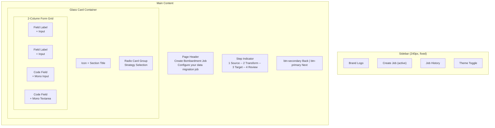
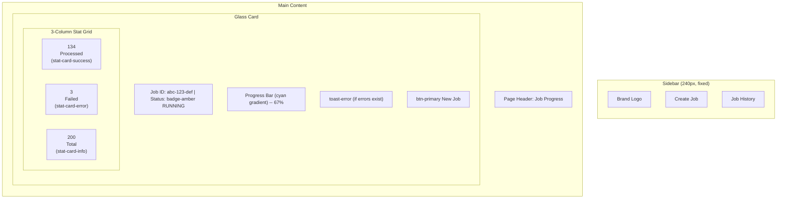

# Bombardment Design System

**Last Updated:** 2026-03-13
**Version:** 1.0
**Tech Stack:** Vanilla JS + Tailwind CSS + Go/Gin backend
**Mode:** Created through deep industry research
**Aesthetic:** Slate & Cyan — Clinical-Professional with Glass elements
**Inspiration:** Linear, Raycast, Warp, Hoppscotch

## Table of Contents

1. [Overview](#overview)
2. [Technology Stack](#technology-stack)
3. [Design Philosophy](#design-philosophy)
4. [Design Tokens](#design-tokens)
5. [Components](#components)
6. [Layout System](#layout-system)
7. [Page Patterns](#page-patterns)
8. [Accessibility Requirements](#accessibility-requirements)
9. [Performance Standards](#performance-standards)
10. [Development Guidelines](#development-guidelines)
11. [Implementation Roadmap](#implementation-roadmap)
12. [Migration Guide](#migration-guide)

## Overview

### Vision

Bombardment's UI should feel like a precision instrument — fast, dense, beautiful in its
restraint. Every pixel earns its place. The interface communicates velocity and control:
you are orchestrating mass API operations, and the tool should feel as powerful as the
work it does.

### Core Principles

1. **Density over whitespace**: Developer tools need information density. Consumer-app
   spacing wastes screen real estate. Show more, scroll less.
2. **Speed as a feature**: Every interaction under 200ms. No unnecessary animations.
   Skeleton loading, not spinners. Optimistic UI where possible.
3. **Code-native feel**: Monospace fonts for data and expressions. Syntax-aware inputs.
   The UI should feel like it was built by someone who writes code daily.
4. **Dark-first**: The primary experience is dark mode. Light mode exists but is
   secondary. Dark backgrounds reduce eye strain during long sessions and make accent
   colors pop.

### Competitive Differentiation

| Tool | Accent | Aesthetic | Bombardment Difference |
| ---- | ------ | --------- | ---------------------- |
| Postman | Orange `#EF5B25` | Light, consumer-friendly | Dark, professional, cyan accent |
| Insomnia | Purple `#4000BF` | Mixed light/dark | Cleaner, more minimal |
| Hoppscotch | Green (default) | Dark, minimal | More refined glass surfaces |
| Thunder Client | Blue | VS Code-embedded | Standalone, richer interaction |

## Technology Stack

### Core Technologies

```text
Frontend:    Vanilla JavaScript (ES2022+)
Styling:     Tailwind CSS v3 (build-time, NOT CDN)
Icons:       Lucide Icons (inline SVG)
Fonts:       IBM Plex Sans + JetBrains Mono (self-hosted)
Backend:     Go 1.23+ with Gin framework
Serving:     Static files embedded in Go binary via Gin
```

### What to Remove (from current implementation)

| Current | Replace With | Why |
| ------- | ------------ | --- |
| CDN Tailwind (`cdn.tailwindcss.com`) | npm Tailwind with build step | CDN is dev-only, no purging, no custom config |
| FontAwesome JS (`6.4.0/js/all.min.js`) | Lucide inline SVGs | FA JS is 400KB+, render-blocking, overkill |
| Animate.css CDN | 4 custom CSS keyframes | 80KB for 2 animations used |
| Google Fonts CDN (Inter) | Self-hosted IBM Plex Sans + JetBrains Mono | Eliminates third-party request, better FOUT control |

### Project Structure (Target)

```text
app/src/app/ui/
├── index.html
└── static/
    ├── fonts/
    │   ├── ibm-plex-sans-400.woff2
    │   ├── ibm-plex-sans-500.woff2
    │   ├── ibm-plex-sans-600.woff2
    │   ├── jetbrains-mono-400.woff2
    │   └── jetbrains-mono-500.woff2
    ├── icons/                          # Lucide SVG sprites
    │   └── icons.svg
    ├── scripts/
    │   ├── main.js
    │   ├── validation.js
    │   └── theme.js                    # Dark/light toggle
    └── styles/
        ├── base.css                    # @tailwind directives + CSS vars
        ├── components.css              # Component-specific styles
        └── output.css                  # Tailwind build output
```

## Design Philosophy

### Slate & Cyan — Clinical Professional

The aesthetic is **Clinical-Professional with Glass accents**, inspired by the generation
of developer tools that prioritize function and beauty simultaneously (Linear, Raycast,
Warp).

**Visual characteristics:**

- Deep slate backgrounds (`#0F172A`) that reduce eye strain
- Semi-transparent glass surfaces with subtle `backdrop-filter: blur`
- `1px` borders using `rgba(255,255,255,0.08)` instead of heavy shadows
- Cyan (`#06B6D4`) as the sole accent color — used sparingly for interactive elements
- High-contrast typography (white at 90%+ opacity) on dark backgrounds
- Functional color coding: cyan = action, green = success, amber = warning, red = error
- Monospace font for all data/code/expression fields

**What this is NOT:**

- Not consumer-friendly with rounded corners everywhere and pastel colors
- Not a generic admin template with orange gradients
- Not overly animated or decorative
- Not low-density with excessive padding between elements

## Design Tokens

All tokens are defined as CSS custom properties on `:root` (dark) and `.light` scope.
Tailwind config extends these tokens for utility class usage.

### Colors

#### Dark Mode (Primary — `:root`)

##### Background and Surface

```css
:root {
  --bg-base:      #0F172A;  /* Slate-900 — main app background */
  --bg-surface:   #1E293B;  /* Slate-800 — cards, panels, sidebar */
  --bg-elevated:  #334155;  /* Slate-700 — dropdowns, tooltips, popovers */
  --bg-overlay:   rgba(0, 0, 0, 0.60);  /* Modal/dialog backdrop */
  --bg-inset:     #0B1120;  /* Deeper than base — code editor areas */
}
```

##### Text Hierarchy

```css
:root {
  --text-primary:   #F1F5F9;  /* Slate-100 — headings, primary content */
  --text-secondary: #94A3B8;  /* Slate-400 — labels, secondary content */
  --text-tertiary:  #64748B;  /* Slate-500 — placeholders, disabled */
  --text-inverse:   #0F172A;  /* Slate-900 — text on accent backgrounds */
}
```

##### Accent (Cyan)

```css
:root {
  --accent:         #06B6D4;  /* Cyan-500 — primary interactive color */
  --accent-hover:   #22D3EE;  /* Cyan-400 — hover state */
  --accent-active:  #0891B2;  /* Cyan-600 — pressed/active state */
  --accent-muted:   rgba(6, 182, 212, 0.15);   /* Subtle accent backgrounds */
  --accent-subtle:  rgba(6, 182, 212, 0.08);   /* Very subtle hover tints */
  --accent-border:  rgba(6, 182, 212, 0.30);   /* Accent-tinted borders */
}
```

##### Borders

```css
:root {
  --border-default: rgba(255, 255, 255, 0.08);  /* Subtle separators */
  --border-hover:   rgba(255, 255, 255, 0.15);  /* Hover state borders */
  --border-focus:   #06B6D4;                     /* Focus ring color */
}
```

##### Semantic / Status Colors

```css
:root {
  /* Success */
  --status-success:       #10B981;  /* Emerald-500 */
  --status-success-muted: rgba(16, 185, 129, 0.15);
  --status-success-text:  #34D399;  /* Emerald-400 — readable on dark */

  /* Warning */
  --status-warning:       #F59E0B;  /* Amber-500 */
  --status-warning-muted: rgba(245, 158, 11, 0.15);
  --status-warning-text:  #FBBF24;  /* Amber-400 */

  /* Error / Destructive */
  --status-error:         #EF4444;  /* Red-500 */
  --status-error-muted:   rgba(239, 68, 68, 0.15);
  --status-error-text:    #F87171;  /* Red-400 */

  /* Info */
  --status-info:          #3B82F6;  /* Blue-500 */
  --status-info-muted:    rgba(59, 130, 246, 0.15);
  --status-info-text:     #60A5FA;  /* Blue-400 */
}
```

##### Glass Effect

```css
:root {
  --glass-bg:     rgba(30, 41, 59, 0.70);   /* Slate-800 at 70% */
  --glass-border: rgba(255, 255, 255, 0.08);
  --glass-blur:   12px;
}
```

#### Light Mode (Secondary — `.light`)

```css
.light {
  --bg-base:      #F8FAFC;  /* Slate-50 */
  --bg-surface:   #FFFFFF;
  --bg-elevated:  #FFFFFF;
  --bg-overlay:   rgba(0, 0, 0, 0.40);
  --bg-inset:     #F1F5F9;  /* Slate-100 */

  --text-primary:   #0F172A;  /* Slate-900 */
  --text-secondary: #475569;  /* Slate-600 */
  --text-tertiary:  #94A3B8;  /* Slate-400 */
  --text-inverse:   #F1F5F9;

  --accent:         #0891B2;  /* Cyan-600 — darker for light bg contrast */
  --accent-hover:   #06B6D4;  /* Cyan-500 */
  --accent-active:  #0E7490;  /* Cyan-700 */
  --accent-muted:   rgba(8, 145, 178, 0.10);
  --accent-subtle:  rgba(8, 145, 178, 0.05);
  --accent-border:  rgba(8, 145, 178, 0.25);

  --border-default: #E2E8F0;  /* Slate-200 */
  --border-hover:   #CBD5E1;  /* Slate-300 */
  --border-focus:   #0891B2;

  --glass-bg:     rgba(255, 255, 255, 0.80);
  --glass-border: rgba(0, 0, 0, 0.08);
  --glass-blur:   12px;

  /* Status colors stay the same but use -500 variants for text (darker) */
  --status-success-text:  #059669;  /* Emerald-600 */
  --status-warning-text:  #D97706;  /* Amber-600 */
  --status-error-text:    #DC2626;  /* Red-600 */
  --status-info-text:     #2563EB;  /* Blue-600 */
}
```

#### Tailwind Config Extension

```js
// tailwind.config.js
module.exports = {
  content: ['./src/app/ui/**/*.{html,js}'],
  theme: {
    extend: {
      colors: {
        'bg-base':     'var(--bg-base)',
        'bg-surface':  'var(--bg-surface)',
        'bg-elevated': 'var(--bg-elevated)',
        'bg-inset':    'var(--bg-inset)',
        'text-primary':   'var(--text-primary)',
        'text-secondary': 'var(--text-secondary)',
        'text-tertiary':  'var(--text-tertiary)',
        accent: {
          DEFAULT: 'var(--accent)',
          hover:   'var(--accent-hover)',
          active:  'var(--accent-active)',
          muted:   'var(--accent-muted)',
          subtle:  'var(--accent-subtle)',
          border:  'var(--accent-border)',
        },
        success: {
          DEFAULT: 'var(--status-success)',
          muted:   'var(--status-success-muted)',
          text:    'var(--status-success-text)',
        },
        warning: {
          DEFAULT: 'var(--status-warning)',
          muted:   'var(--status-warning-muted)',
          text:    'var(--status-warning-text)',
        },
        error: {
          DEFAULT: 'var(--status-error)',
          muted:   'var(--status-error-muted)',
          text:    'var(--status-error-text)',
        },
        info: {
          DEFAULT: 'var(--status-info)',
          muted:   'var(--status-info-muted)',
          text:    'var(--status-info-text)',
        },
      },
      borderColor: {
        DEFAULT: 'var(--border-default)',
        hover:   'var(--border-hover)',
        focus:   'var(--border-focus)',
      },
      fontFamily: {
        sans: ['IBM Plex Sans', 'system-ui', '-apple-system', 'sans-serif'],
        mono: ['JetBrains Mono', 'Fira Code', 'ui-monospace', 'monospace'],
      },
      borderRadius: {
        sm: '4px',
        DEFAULT: '8px',
        md: '8px',
        lg: '12px',
        xl: '16px',
      },
      boxShadow: {
        sm:   '0 1px 2px rgba(0, 0, 0, 0.3)',
        DEFAULT: '0 4px 6px -1px rgba(0, 0, 0, 0.4)',
        lg:   '0 10px 15px -3px rgba(0, 0, 0, 0.5)',
        glow: '0 0 20px rgba(6, 182, 212, 0.15)',
      },
    },
  },
  plugins: [],
};
```

### Typography

#### Font Families

| Role | Font | Weights | Use |
| ---- | ---- | ------- | --- |
| **UI (sans)** | IBM Plex Sans | 400, 500, 600 | All interface text, labels, headings |
| **Code (mono)** | JetBrains Mono | 400, 500 | Expressions, code, data values, IDs |

**Why IBM Plex Sans over Inter?** Inter is the default "safe" choice for every SaaS app.
IBM Plex Sans has more character — slightly more humanist proportions, excellent at small
sizes, and pairs perfectly with JetBrains Mono. Using it signals intentional typographic
choice.

**Why JetBrains Mono?** Purpose-built for code readability. Increased letter height,
distinctive character forms (`0` vs `O`, `1` vs `l` vs `I`), built-in ligatures.
Essential for a tool where users write transformation expressions.

#### Font Loading

```css
/* base.css — self-hosted, no external requests */
@font-face {
  font-family: 'IBM Plex Sans';
  src: url('/static/fonts/ibm-plex-sans-400.woff2') format('woff2');
  font-weight: 400;
  font-style: normal;
  font-display: swap;
}
@font-face {
  font-family: 'IBM Plex Sans';
  src: url('/static/fonts/ibm-plex-sans-500.woff2') format('woff2');
  font-weight: 500;
  font-style: normal;
  font-display: swap;
}
@font-face {
  font-family: 'IBM Plex Sans';
  src: url('/static/fonts/ibm-plex-sans-600.woff2') format('woff2');
  font-weight: 600;
  font-style: normal;
  font-display: swap;
}
@font-face {
  font-family: 'JetBrains Mono';
  src: url('/static/fonts/jetbrains-mono-400.woff2') format('woff2');
  font-weight: 400;
  font-style: normal;
  font-display: swap;
}
@font-face {
  font-family: 'JetBrains Mono';
  src: url('/static/fonts/jetbrains-mono-500.woff2') format('woff2');
  font-weight: 500;
  font-style: normal;
  font-display: swap;
}
```

#### Type Scale

Based on a 1.2 ratio (Minor Third), optimized for information-dense UIs.

| Token | Size | Weight | Line Height | Use |
| ----- | ---- | ------ | ----------- | --- |
| `text-xs` | 11px / 0.6875rem | 500 | 1.45 | Badges, timestamps, fine print |
| `text-sm` | 13px / 0.8125rem | 400 | 1.5 | Labels, help text, captions |
| `text-base` | 15px / 0.9375rem | 400 | 1.6 | Body text, form inputs |
| `text-md` | 17px / 1.0625rem | 500 | 1.5 | Card titles, emphasis |
| `text-lg` | 20px / 1.25rem | 600 | 1.4 | Section headings |
| `text-xl` | 24px / 1.5rem | 600 | 1.3 | Page headings |
| `text-2xl` | 30px / 1.875rem | 600 | 1.2 | Hero/display text |

#### Font Features

All monospace text must enable these OpenType features:

```css
.font-mono {
  font-feature-settings: "tnum" 1, "zero" 1;
  font-variant-numeric: tabular-nums slashed-zero;
}
```

- `tnum`: Tabular (fixed-width) numbers — aligns columns in tables
- `zero`: Slashed zero — distinguishes `0` from `O`

### Spacing

4px base unit. This gives finer granularity than 8px, which dense developer UIs need.

| Token | Value | Tailwind Class | Use |
| ----- | ----- | -------------- | --- |
| `space-0.5` | 2px | `p-0.5` | Tight inner gaps |
| `space-1` | 4px | `p-1` | Icon-to-text gaps |
| `space-1.5` | 6px | `p-1.5` | Compact element padding |
| `space-2` | 8px | `p-2` | Small padding, list gaps |
| `space-3` | 12px | `p-3` | Medium padding |
| `space-4` | 16px | `p-4` | Standard card padding |
| `space-5` | 20px | `p-5` | Section gaps |
| `space-6` | 24px | `p-6` | Card body padding |
| `space-8` | 32px | `p-8` | Major section separation |
| `space-10` | 40px | `p-10` | Large layout division |
| `space-12` | 48px | `p-12` | Page-level spacing |

### Borders

#### Radius Scale

| Token | Value | Use |
| ----- | ----- | --- |
| `rounded-sm` | 4px | Badges, small elements |
| `rounded` / `rounded-md` | 8px | Buttons, inputs, cards (default) |
| `rounded-lg` | 12px | Panels, modals, large cards |
| `rounded-xl` | 16px | Hero sections |
| `rounded-full` | 9999px | Pills, avatars, circular buttons |

#### Border Width

| Token | Value | Use |
| ----- | ----- | --- |
| `border` | 1px | Default borders (all components) |
| `border-2` | 2px | Focus rings, active tab indicators |

### Motion

#### Duration Scale

| Token | Duration | Use |
| ----- | -------- | --- |
| `duration-instant` | 100ms | Hover color changes, toggles |
| `duration-fast` | 150ms | Button press, tooltip show |
| `duration-normal` | 200ms | Dropdown open, tab switch |
| `duration-slow` | 300ms | Modal open/close, sidebar collapse |
| `duration-slower` | 500ms | Progress bar fill, page transitions |

#### Easing Functions

| Token | Value | Use |
| ----- | ----- | --- |
| `ease-standard` | `cubic-bezier(0.4, 0, 0.2, 1)` | General transitions |
| `ease-enter` | `cubic-bezier(0, 0, 0.2, 1)` | Elements appearing |
| `ease-exit` | `cubic-bezier(0.4, 0, 1, 1)` | Elements disappearing |

#### Default Transition

```css
/* Apply to all interactive elements */
transition: all 150ms cubic-bezier(0.4, 0, 0.2, 1);
```

#### Reduced Motion

```css
@media (prefers-reduced-motion: reduce) {
  *, *::before, *::after {
    animation-duration: 0.01ms !important;
    animation-iteration-count: 1 !important;
    transition-duration: 0.01ms !important;
  }
}
```

### Shadows

In dark mode, prefer `backdrop-filter: blur` over shadows. Shadows disappear against
dark backgrounds. Use shadows primarily in light mode.

| Token | Dark Mode Value | Light Mode Value | Use |
| ----- | --------------- | ---------------- | --- |
| `shadow-sm` | `0 1px 2px rgba(0,0,0,0.3)` | `0 1px 2px rgba(0,0,0,0.05)` | Subtle depth |
| `shadow` | `0 4px 6px -1px rgba(0,0,0,0.4)` | `0 4px 6px -1px rgba(0,0,0,0.1)` | Cards |
| `shadow-lg` | `0 10px 15px -3px rgba(0,0,0,0.5)` | `0 10px 15px -3px rgba(0,0,0,0.1)` | Modals |
| `shadow-glow` | `0 0 20px rgba(6,182,212,0.15)` | `0 0 15px rgba(8,145,178,0.10)` | Accent glow |

## Components

Every component below is specified with exact CSS/Tailwind classes ready for
implementation. No frameworks needed — pure HTML + CSS + minimal JS.

### Button

**Purpose:** Primary interactive element for actions.

#### Variants

| Variant | Background | Text | Border | Use |
| ------- | ---------- | ---- | ------ | --- |
| `primary` | `accent` gradient | White | `accent-border` | Primary actions (Next, Submit, Run) |
| `secondary` | Transparent | `accent` | `border-default` | Secondary actions (Back, Cancel) |
| `ghost` | Transparent | `text-secondary` | None | Tertiary actions, icon buttons |
| `destructive` | `error-muted` | `error-text` | `error` border | Dangerous actions (Delete, Remove) |

#### Sizes

| Size | Height | Padding (x) | Font Size | Icon Size |
| ---- | ------ | ----------- | --------- | --------- |
| `sm` | 32px | 12px | 13px | 14px |
| `md` | 36px | 16px | 14px | 16px |
| `lg` | 40px | 20px | 15px | 18px |

#### States

| State | Visual Change |
| ----- | ------------- |
| Default | As defined by variant |
| Hover | Lighten background, optional `shadow-glow` on primary |
| Active | Darken background, `transform: scale(0.98)` |
| Disabled | `opacity: 0.5`, `cursor: not-allowed`, `pointer-events: none` |
| Loading | Spinner icon replaces text icon, disabled interaction |
| Focus | `2px` accent ring via `box-shadow: 0 0 0 2px var(--accent-border)` |

#### Implementation

```css
/* Base button */
.btn {
  display: inline-flex;
  align-items: center;
  justify-content: center;
  gap: 8px;
  font-family: var(--font-sans);
  font-weight: 500;
  border-radius: 8px;
  cursor: pointer;
  transition: all 150ms cubic-bezier(0.4, 0, 0.2, 1);
  white-space: nowrap;
  user-select: none;
}

/* Size: md (default) */
.btn { height: 36px; padding: 0 16px; font-size: 14px; }
.btn-sm { height: 32px; padding: 0 12px; font-size: 13px; }
.btn-lg { height: 40px; padding: 0 20px; font-size: 15px; }

/* Variant: primary */
.btn-primary {
  background: linear-gradient(135deg, #06B6D4, #0891B2);
  color: white;
  border: 1px solid var(--accent-border);
}
.btn-primary:hover {
  background: linear-gradient(135deg, #22D3EE, #06B6D4);
  box-shadow: 0 0 20px rgba(6, 182, 212, 0.20);
}
.btn-primary:active { background: #0891B2; transform: scale(0.98); }

/* Variant: secondary */
.btn-secondary {
  background: transparent;
  color: var(--accent);
  border: 1px solid var(--border-default);
}
.btn-secondary:hover {
  background: var(--accent-subtle);
  border-color: var(--accent-border);
}

/* Variant: ghost */
.btn-ghost {
  background: transparent;
  color: var(--text-secondary);
  border: 1px solid transparent;
}
.btn-ghost:hover { background: var(--accent-subtle); color: var(--text-primary); }

/* Variant: destructive */
.btn-destructive {
  background: var(--status-error-muted);
  color: var(--status-error-text);
  border: 1px solid rgba(239, 68, 68, 0.25);
}
.btn-destructive:hover { background: rgba(239, 68, 68, 0.25); }

/* Disabled (all variants) */
.btn:disabled, .btn[disabled] {
  opacity: 0.5;
  cursor: not-allowed;
  pointer-events: none;
}

/* Focus (all variants) */
.btn:focus-visible {
  outline: none;
  box-shadow: 0 0 0 2px var(--bg-base), 0 0 0 4px var(--accent);
}
```

#### Usage

```html
<button class="btn btn-primary">
  <svg class="w-4 h-4"><!-- Lucide icon --></svg>
  Run Bombardment
</button>
<button class="btn btn-secondary">Back</button>
<button class="btn btn-ghost btn-sm">
  <svg class="w-4 h-4"><!-- icon --></svg>
</button>
```

### Input

**Purpose:** Text and number input fields.

#### Variants

| Variant | Description |
| ------- | ----------- |
| `default` | Standard text input |
| `with-icon` | Left icon inside the field |
| `with-addon` | Left label area (e.g., "https://") |
| `code` | Monospace font, darker bg, for expressions |

#### Implementation

```css
.input {
  width: 100%;
  height: 36px;
  padding: 0 12px;
  font-family: var(--font-sans);
  font-size: 14px;
  color: var(--text-primary);
  background: var(--bg-surface);
  border: 1px solid var(--border-default);
  border-radius: 8px;
  transition: all 150ms cubic-bezier(0.4, 0, 0.2, 1);
}
.input::placeholder { color: var(--text-tertiary); }
.input:hover { border-color: var(--border-hover); }
.input:focus {
  outline: none;
  border-color: var(--border-focus);
  box-shadow: 0 0 0 2px var(--accent-muted);
}

/* Error state */
.input-error { border-color: var(--status-error); }
.input-error:focus { box-shadow: 0 0 0 2px var(--status-error-muted); }

/* Success state */
.input-success { border-color: var(--status-success); }

/* Code variant — for expressions, endpoints, JSON */
.input-code {
  font-family: var(--font-mono);
  font-size: 13px;
  font-feature-settings: "tnum" 1, "zero" 1;
  background: var(--bg-inset);
  letter-spacing: -0.01em;
}

/* With icon */
.input-group { position: relative; }
.input-group .input { padding-left: 36px; }
.input-group .input-icon {
  position: absolute;
  left: 12px;
  top: 50%;
  transform: translateY(-50%);
  color: var(--text-tertiary);
  width: 16px;
  height: 16px;
  pointer-events: none;
}

/* With addon */
.input-addon {
  display: flex;
  align-items: center;
  padding: 0 12px;
  background: var(--bg-elevated);
  border: 1px solid var(--border-default);
  border-right: none;
  border-radius: 8px 0 0 8px;
  color: var(--text-secondary);
  font-size: 13px;
  white-space: nowrap;
}
.input-addon + .input { border-radius: 0 8px 8px 0; }
```

#### Usage

```html
<!-- Standard -->
<input class="input" type="text" placeholder="Enter value">

<!-- With icon -->
<div class="input-group">
  <svg class="input-icon"><!-- Lucide icon --></svg>
  <input class="input" type="text" placeholder="Search...">
</div>

<!-- Code variant -->
<input class="input input-code" type="text" placeholder='"POST"'
       value='"POST"'>

<!-- With addon -->
<div class="flex">
  <span class="input-addon">
    <svg class="w-4 h-4 mr-1.5"><!-- icon --></svg>
    Method
  </span>
  <input class="input input-code" type="text">
</div>

<!-- Error state -->
<input class="input input-error" type="text">
<p class="text-sm text-error-text mt-1">URL format is invalid</p>
```

### Textarea

**Purpose:** Multi-line input for expressions, headers, body content.

```css
.textarea {
  width: 100%;
  min-height: 80px;
  padding: 12px;
  font-family: var(--font-sans);
  font-size: 14px;
  color: var(--text-primary);
  background: var(--bg-surface);
  border: 1px solid var(--border-default);
  border-radius: 8px;
  resize: vertical;
  transition: border-color 150ms cubic-bezier(0.4, 0, 0.2, 1);
  line-height: 1.6;
}
.textarea:focus {
  outline: none;
  border-color: var(--border-focus);
  box-shadow: 0 0 0 2px var(--accent-muted);
}

/* Code textarea — for JSON, expressions */
.textarea-code {
  font-family: var(--font-mono);
  font-size: 13px;
  font-feature-settings: "tnum" 1, "zero" 1;
  background: var(--bg-inset);
  line-height: 1.7;
  tab-size: 2;
}
```

### Select

**Purpose:** Dropdown selection for strategies and options.

```css
.select {
  appearance: none;
  width: 100%;
  height: 36px;
  padding: 0 36px 0 12px;
  font-family: var(--font-sans);
  font-size: 14px;
  color: var(--text-primary);
  background: var(--bg-surface);
  border: 1px solid var(--border-default);
  border-radius: 8px;
  cursor: pointer;
  transition: all 150ms cubic-bezier(0.4, 0, 0.2, 1);
  /* Custom arrow via inline SVG background */
  background-image: url("data:image/svg+xml,%3Csvg xmlns='http://www.w3.org/2000/svg' width='16' height='16' viewBox='0 0 24 24' fill='none' stroke='%2394A3B8' stroke-width='2'%3E%3Cpath d='m6 9 6 6 6-6'/%3E%3C/svg%3E");
  background-repeat: no-repeat;
  background-position: right 12px center;
}
.select:hover { border-color: var(--border-hover); }
.select:focus {
  outline: none;
  border-color: var(--border-focus);
  box-shadow: 0 0 0 2px var(--accent-muted);
}
```

### Radio Card Group

**Purpose:** Strategy selectors (CSV/JSON, REST/gRPC, Round Robin/Random).

```css
.radio-card-group {
  display: flex;
  flex-wrap: wrap;
  gap: 8px;
}
.radio-card {
  display: inline-flex;
  align-items: center;
  padding: 10px 16px;
  background: var(--bg-surface);
  border: 1px solid var(--border-default);
  border-radius: 8px;
  cursor: pointer;
  transition: all 150ms cubic-bezier(0.4, 0, 0.2, 1);
  user-select: none;
}
.radio-card:hover {
  border-color: var(--accent-border);
  background: var(--accent-subtle);
}

/* Active/selected state */
.radio-card.active,
.radio-card:has(input:checked) {
  border-color: var(--accent);
  background: var(--accent-muted);
  color: var(--accent-hover);
}

/* Disabled state (coming soon) */
.radio-card.disabled {
  opacity: 0.4;
  cursor: not-allowed;
  pointer-events: none;
  position: relative;
}

/* Hidden radio input */
.radio-card input[type="radio"] {
  position: absolute;
  opacity: 0;
  width: 0;
  height: 0;
}

.radio-card .radio-label {
  font-size: 14px;
  font-weight: 500;
  color: var(--text-primary);
}

/* "Soon" badge */
.badge-soon {
  position: absolute;
  top: -6px;
  right: -6px;
  background: var(--bg-elevated);
  color: var(--text-secondary);
  font-size: 9px;
  font-weight: 700;
  padding: 1px 6px;
  border-radius: 9999px;
  text-transform: uppercase;
  letter-spacing: 0.05em;
  border: 1px solid var(--border-default);
}
```

#### Usage

```html
<div class="radio-card-group" role="radiogroup" aria-label="Parser Strategy">
  <label class="radio-card active">
    <input type="radio" name="parser_strategy" value="CSV" checked>
    <span class="radio-label">CSV</span>
  </label>
  <label class="radio-card">
    <input type="radio" name="parser_strategy" value="JSON">
    <span class="radio-label">JSON</span>
  </label>
  <label class="radio-card disabled">
    <input type="radio" name="parser_strategy" value="XML" disabled>
    <span class="radio-label">XML</span>
    <span class="badge-soon">Soon</span>
  </label>
</div>
```

### Checkbox

**Purpose:** Toggle options (Store responses, Skip TLS verify).

```css
.checkbox-wrapper {
  display: flex;
  align-items: center;
  gap: 8px;
  cursor: pointer;
}
.checkbox {
  appearance: none;
  width: 18px;
  height: 18px;
  border: 1px solid var(--border-default);
  border-radius: 4px;
  background: var(--bg-surface);
  cursor: pointer;
  transition: all 150ms;
  position: relative;
}
.checkbox:checked {
  background: var(--accent);
  border-color: var(--accent);
}
.checkbox:checked::after {
  content: '';
  position: absolute;
  left: 5px;
  top: 2px;
  width: 5px;
  height: 9px;
  border: solid white;
  border-width: 0 2px 2px 0;
  transform: rotate(45deg);
}
.checkbox:focus-visible {
  box-shadow: 0 0 0 2px var(--bg-base), 0 0 0 4px var(--accent);
}
.checkbox-label {
  font-size: 14px;
  color: var(--text-primary);
  user-select: none;
}
```

### Card (Glass Surface)

**Purpose:** Primary container for content sections.

#### Variants

| Variant | Description |
| ------- | ----------- |
| `card` | Standard glass card — main content container |
| `card-flat` | No glass, just subtle border — for nested cards |
| `card-inset` | Darker background — for code/config sections |

```css
/* Standard glass card */
.card {
  background: var(--glass-bg);
  backdrop-filter: blur(var(--glass-blur));
  -webkit-backdrop-filter: blur(var(--glass-blur));
  border: 1px solid var(--glass-border);
  border-radius: 12px;
  padding: 24px;
}

/* Flat card (nested) */
.card-flat {
  background: var(--bg-surface);
  border: 1px solid var(--border-default);
  border-radius: 8px;
  padding: 20px;
}

/* Inset card (config/code sections) */
.card-inset {
  background: var(--bg-inset);
  border: 1px solid var(--border-default);
  border-radius: 8px;
  padding: 16px;
}

/* Light mode: cards use solid backgrounds */
.light .card {
  background: var(--bg-surface);
  backdrop-filter: none;
  border-color: var(--border-default);
  box-shadow: 0 1px 3px rgba(0, 0, 0, 0.08);
}
```

### Badge / Tag

**Purpose:** Status indicators (PENDING, RUNNING, COMPLETED, FAILED).

#### Variants

| Variant | Background | Text | Use |
| ------- | ---------- | ---- | --- |
| `badge-cyan` | `accent-muted` | Cyan-400 | Default, info, pending |
| `badge-green` | `success-muted` | Emerald-400 | Success, completed |
| `badge-amber` | `warning-muted` | Amber-400 | Warning, running |
| `badge-red` | `error-muted` | Red-400 | Error, failed |
| `badge-slate` | `bg-elevated` | Slate-400 | Neutral, inactive |

```css
.badge {
  display: inline-flex;
  align-items: center;
  gap: 4px;
  padding: 2px 10px;
  border-radius: 9999px;
  font-family: var(--font-mono);
  font-size: 11px;
  font-weight: 600;
  letter-spacing: 0.04em;
  text-transform: uppercase;
  white-space: nowrap;
}
.badge-cyan {
  background: var(--accent-muted);
  color: #22D3EE;
  border: 1px solid var(--accent-border);
}
.badge-green {
  background: var(--status-success-muted);
  color: var(--status-success-text);
  border: 1px solid rgba(16, 185, 129, 0.25);
}
.badge-amber {
  background: var(--status-warning-muted);
  color: var(--status-warning-text);
  border: 1px solid rgba(245, 158, 11, 0.25);
}
.badge-red {
  background: var(--status-error-muted);
  color: var(--status-error-text);
  border: 1px solid rgba(239, 68, 68, 0.25);
}
.badge-slate {
  background: var(--bg-elevated);
  color: var(--text-secondary);
  border: 1px solid var(--border-default);
}
```

#### Usage

```html
<span class="badge badge-green">COMPLETED</span>
<span class="badge badge-amber">RUNNING</span>
<span class="badge badge-red">FAILED</span>
<span class="badge badge-cyan">PENDING</span>
```

### Step Indicator (Wizard)

**Purpose:** Shows progress through the 4-step wizard (Source → Transform → Target →
Review).

**Design:** Horizontal timeline with numbered circles connected by lines. Replaces the
current complex clip-path arrow approach.

```css
.steps {
  display: flex;
  align-items: center;
  width: 100%;
  padding: 0;
  margin: 0;
  list-style: none;
}
.step {
  display: flex;
  align-items: center;
  flex: 1;
}

/* Connector line */
.step:not(:last-child)::after {
  content: '';
  flex: 1;
  height: 2px;
  background: var(--border-default);
  margin: 0 12px;
  transition: background 300ms;
}
.step.completed:not(:last-child)::after {
  background: var(--accent);
}

/* Step circle + label */
.step-trigger {
  display: flex;
  flex-direction: column;
  align-items: center;
  gap: 8px;
  white-space: nowrap;
}
.step-circle {
  width: 36px;
  height: 36px;
  border-radius: 50%;
  display: flex;
  align-items: center;
  justify-content: center;
  font-size: 14px;
  font-weight: 600;
  border: 2px solid var(--border-default);
  background: var(--bg-surface);
  color: var(--text-tertiary);
  transition: all 200ms;
}
.step-label {
  font-size: 13px;
  font-weight: 500;
  color: var(--text-tertiary);
  transition: color 200ms;
}

/* Active step */
.step.active .step-circle {
  border-color: var(--accent);
  background: var(--accent-muted);
  color: var(--accent-hover);
  box-shadow: 0 0 0 4px var(--accent-subtle);
}
.step.active .step-label { color: var(--accent-hover); }

/* Completed step */
.step.completed .step-circle {
  border-color: var(--accent);
  background: var(--accent);
  color: white;
}
.step.completed .step-label { color: var(--text-primary); }

/* Responsive: hide labels on small screens */
@media (max-width: 480px) {
  .step-label { display: none; }
  .step-circle { width: 32px; height: 32px; font-size: 12px; }
}
```

#### Usage

```html
<ol class="steps" aria-label="Job creation progress">
  <li class="step completed">
    <div class="step-trigger">
      <div class="step-circle" aria-label="Step 1 complete">
        <svg class="w-4 h-4"><!-- check icon --></svg>
      </div>
      <span class="step-label">Source</span>
    </div>
  </li>
  <li class="step active" aria-current="step">
    <div class="step-trigger">
      <div class="step-circle">2</div>
      <span class="step-label">Transform</span>
    </div>
  </li>
  <li class="step">
    <div class="step-trigger">
      <div class="step-circle">3</div>
      <span class="step-label">Target</span>
    </div>
  </li>
  <li class="step">
    <div class="step-trigger">
      <div class="step-circle">4</div>
      <span class="step-label">Review</span>
    </div>
  </li>
</ol>
```

### Progress Bar

**Purpose:** Job execution progress tracking.

```css
.progress-track {
  height: 6px;
  background: var(--border-default);
  border-radius: 9999px;
  overflow: hidden;
}
.progress-fill {
  height: 100%;
  border-radius: 9999px;
  background: linear-gradient(90deg, #06B6D4, #22D3EE);
  transition: width 500ms cubic-bezier(0.4, 0, 0.2, 1);
}
.progress-fill[data-status="success"] {
  background: linear-gradient(90deg, #10B981, #34D399);
}
.progress-fill[data-status="error"] {
  background: linear-gradient(90deg, #EF4444, #F87171);
}
```

#### Usage

```html
<div class="progress-track" role="progressbar"
     aria-valuenow="67" aria-valuemin="0" aria-valuemax="100">
  <div class="progress-fill" style="width: 67%"></div>
</div>
```

### Sidebar

**Purpose:** Primary navigation.

```css
.sidebar {
  position: fixed;
  left: 0;
  top: 0;
  bottom: 0;
  width: 240px;
  background: var(--bg-surface);
  border-right: 1px solid var(--border-default);
  display: flex;
  flex-direction: column;
  z-index: 40;
  transition: width 200ms cubic-bezier(0.4, 0, 0.2, 1);
  overflow: hidden;
}

/* Logo area */
.sidebar-header {
  padding: 20px 16px;
  display: flex;
  align-items: center;
  gap: 10px;
}
.sidebar-logo {
  width: 28px;
  height: 28px;
  color: var(--accent);
  flex-shrink: 0;
}
.sidebar-title {
  font-size: 17px;
  font-weight: 600;
  color: var(--text-primary);
  white-space: nowrap;
}

/* Nav section */
.sidebar-nav {
  padding: 8px;
  flex: 1;
}
.sidebar-section-label {
  font-size: 11px;
  font-weight: 600;
  color: var(--text-tertiary);
  text-transform: uppercase;
  letter-spacing: 0.06em;
  padding: 8px 12px 4px;
}
.sidebar-link {
  display: flex;
  align-items: center;
  gap: 10px;
  padding: 8px 12px;
  border-radius: 8px;
  font-size: 14px;
  font-weight: 400;
  color: var(--text-secondary);
  cursor: pointer;
  transition: all 150ms;
  white-space: nowrap;
}
.sidebar-link:hover {
  background: var(--accent-subtle);
  color: var(--text-primary);
}
.sidebar-link.active {
  background: var(--accent-muted);
  color: var(--accent-hover);
  font-weight: 500;
}
.sidebar-link svg {
  width: 18px;
  height: 18px;
  flex-shrink: 0;
}

/* Collapsed sidebar */
.sidebar.collapsed { width: 56px; }
.sidebar.collapsed .sidebar-title,
.sidebar.collapsed .sidebar-section-label,
.sidebar.collapsed .sidebar-link span { display: none; }
.sidebar.collapsed .sidebar-link { justify-content: center; padding: 10px; }

/* Footer (theme toggle, version) */
.sidebar-footer {
  padding: 12px 16px;
  border-top: 1px solid var(--border-default);
}

/* Mobile: overlay sidebar */
@media (max-width: 768px) {
  .sidebar {
    transform: translateX(-100%);
    box-shadow: 4px 0 24px rgba(0, 0, 0, 0.3);
  }
  .sidebar.open { transform: translateX(0); }
  .sidebar-overlay {
    position: fixed;
    inset: 0;
    background: var(--bg-overlay);
    z-index: 39;
  }
}
```

### Page Header

**Purpose:** Title area at the top of each page view.

```css
.page-header {
  padding: 24px 0 20px;
}
.page-header h1 {
  font-size: 24px;
  font-weight: 600;
  color: var(--text-primary);
  margin: 0;
}
.page-header p {
  font-size: 14px;
  color: var(--text-secondary);
  margin: 4px 0 0;
}
```

**Note:** No gradient backgrounds on page headers. The old orange gradient header is
removed. Clean, flat, typographic hierarchy only.

### Stat Card

**Purpose:** Display metrics in Job Progress (Processed, Failed, Total).

```css
.stat-card {
  background: var(--bg-surface);
  border: 1px solid var(--border-default);
  border-radius: 8px;
  padding: 16px;
  text-align: center;
}
.stat-value {
  font-family: var(--font-mono);
  font-size: 24px;
  font-weight: 600;
  font-feature-settings: "tnum" 1;
}
.stat-label {
  font-size: 12px;
  font-weight: 500;
  color: var(--text-secondary);
  margin-top: 2px;
  text-transform: uppercase;
  letter-spacing: 0.04em;
}

/* Colored variants */
.stat-card-success { border-color: rgba(16, 185, 129, 0.25); }
.stat-card-success .stat-value { color: var(--status-success-text); }
.stat-card-error { border-color: rgba(239, 68, 68, 0.25); }
.stat-card-error .stat-value { color: var(--status-error-text); }
.stat-card-info { border-color: var(--accent-border); }
.stat-card-info .stat-value { color: var(--accent-hover); }
```

### Config Summary Card

**Purpose:** Review step — displays configuration sections (Source, Transform, Target).

```css
.config-card {
  background: var(--bg-surface);
  border: 1px solid var(--border-default);
  border-radius: 12px;
  overflow: hidden;
  transition: border-color 200ms;
}
.config-card:hover { border-color: var(--border-hover); }

.config-card-header {
  display: flex;
  align-items: center;
  padding: 14px 16px;
  border-bottom: 1px solid var(--border-default);
}
.config-card-icon {
  width: 36px;
  height: 36px;
  border-radius: 8px;
  display: flex;
  align-items: center;
  justify-content: center;
  margin-right: 12px;
  flex-shrink: 0;
}
/* Icon backgrounds per section */
.config-card-icon.source  { background: var(--accent-muted); color: var(--accent); }
.config-card-icon.transform { background: rgba(124, 58, 237, 0.15); color: #A78BFA; }
.config-card-icon.target  { background: var(--status-success-muted); color: var(--status-success-text); }
.config-card-icon.driver  { background: var(--status-info-muted); color: var(--status-info-text); }

.config-card-title {
  font-size: 15px;
  font-weight: 600;
  color: var(--text-primary);
}

.config-card-body { padding: 12px 16px; }

.config-row {
  display: flex;
  align-items: center;
  padding: 8px 0;
  border-bottom: 1px dashed var(--border-default);
  min-height: 36px;
}
.config-row:last-child { border-bottom: none; }
.config-row-label {
  width: 40%;
  font-size: 13px;
  font-weight: 500;
  color: var(--text-secondary);
}
.config-row-value {
  width: 60%;
  font-size: 13px;
  font-weight: 500;
  color: var(--text-primary);
  word-break: break-all;
}
/* Monospace values for technical data */
.config-row-value.mono {
  font-family: var(--font-mono);
  font-size: 12px;
}
```

### Empty State

**Purpose:** Shown when no data exists (no jobs, no results).

```css
.empty-state {
  display: flex;
  flex-direction: column;
  align-items: center;
  justify-content: center;
  padding: 48px 24px;
  text-align: center;
}
.empty-state-icon {
  width: 48px;
  height: 48px;
  color: var(--text-tertiary);
  margin-bottom: 16px;
}
.empty-state-title {
  font-size: 17px;
  font-weight: 600;
  color: var(--text-primary);
  margin-bottom: 4px;
}
.empty-state-description {
  font-size: 14px;
  color: var(--text-secondary);
  max-width: 360px;
  margin-bottom: 20px;
}
```

#### Usage

```html
<div class="empty-state">
  <svg class="empty-state-icon"><!-- inbox icon --></svg>
  <h3 class="empty-state-title">No jobs yet</h3>
  <p class="empty-state-description">
    Create your first bombardment job to start migrating data.
  </p>
  <button class="btn btn-primary">Create Job</button>
</div>
```

### Toast / Alert

**Purpose:** Feedback messages for success, error, warnings.

```css
.toast {
  display: flex;
  align-items: flex-start;
  gap: 12px;
  padding: 12px 16px;
  border-radius: 8px;
  font-size: 14px;
  max-width: 420px;
  border: 1px solid;
  animation: slideIn 200ms ease-out;
}
.toast-icon { width: 18px; height: 18px; flex-shrink: 0; margin-top: 1px; }
.toast-message { color: var(--text-primary); flex: 1; }
.toast-close {
  background: none;
  border: none;
  color: var(--text-tertiary);
  cursor: pointer;
  padding: 0;
}

.toast-success {
  background: var(--status-success-muted);
  border-color: rgba(16, 185, 129, 0.25);
}
.toast-success .toast-icon { color: var(--status-success-text); }

.toast-error {
  background: var(--status-error-muted);
  border-color: rgba(239, 68, 68, 0.25);
}
.toast-error .toast-icon { color: var(--status-error-text); }

.toast-warning {
  background: var(--status-warning-muted);
  border-color: rgba(245, 158, 11, 0.25);
}
.toast-warning .toast-icon { color: var(--status-warning-text); }

@keyframes slideIn {
  from { opacity: 0; transform: translateY(-8px); }
  to   { opacity: 1; transform: translateY(0); }
}
```

### Theme Toggle

**Purpose:** Switch between dark and light mode.

```css
.theme-toggle {
  width: 36px;
  height: 36px;
  display: flex;
  align-items: center;
  justify-content: center;
  border-radius: 8px;
  background: transparent;
  border: 1px solid var(--border-default);
  color: var(--text-secondary);
  cursor: pointer;
  transition: all 150ms;
}
.theme-toggle:hover {
  background: var(--accent-subtle);
  color: var(--text-primary);
}
.theme-toggle svg { width: 18px; height: 18px; }
```

#### JavaScript

```js
// theme.js
const THEME_KEY = 'bombardment-theme';

function initTheme() {
  const stored = localStorage.getItem(THEME_KEY);
  const prefersDark = window.matchMedia('(prefers-color-scheme: dark)').matches;
  const isDark = stored ? stored === 'dark' : prefersDark;
  document.documentElement.classList.toggle('light', !isDark);
}

function toggleTheme() {
  const isLight = document.documentElement.classList.toggle('light');
  localStorage.setItem(THEME_KEY, isLight ? 'light' : 'dark');
  // Swap icon: sun ↔ moon
}

initTheme();
```

### Job History Table

**Purpose:** List of all bombardment jobs with status and progress.

```css
.table-container {
  width: 100%;
  overflow-x: auto;
  border: 1px solid var(--border-default);
  border-radius: 12px;
}
.table {
  width: 100%;
  border-collapse: collapse;
  font-size: 14px;
}
.table th {
  text-align: left;
  padding: 10px 16px;
  font-size: 12px;
  font-weight: 600;
  color: var(--text-secondary);
  text-transform: uppercase;
  letter-spacing: 0.04em;
  background: var(--bg-surface);
  border-bottom: 1px solid var(--border-default);
}
.table td {
  padding: 12px 16px;
  color: var(--text-primary);
  border-bottom: 1px solid var(--border-default);
}
.table tr:last-child td { border-bottom: none; }
.table tr:hover td { background: var(--accent-subtle); }

/* Monospace columns */
.table .col-id {
  font-family: var(--font-mono);
  font-size: 12px;
  color: var(--text-secondary);
}
.table .col-time {
  font-family: var(--font-mono);
  font-size: 12px;
}

/* Mobile: card layout instead of table */
@media (max-width: 768px) {
  .table thead { display: none; }
  .table tr {
    display: block;
    padding: 12px 16px;
    border-bottom: 1px solid var(--border-default);
  }
  .table td {
    display: flex;
    justify-content: space-between;
    padding: 4px 0;
    border: none;
  }
  .table td::before {
    content: attr(data-label);
    font-weight: 500;
    color: var(--text-secondary);
    font-size: 12px;
  }
}
```

## Layout System

### Main Layout

```css
.app-layout {
  display: flex;
  min-height: 100vh;
  background: var(--bg-base);
  color: var(--text-primary);
}
.main-content {
  flex: 1;
  margin-left: 240px;
  padding: 24px 32px;
  max-width: 1280px;
  transition: margin-left 200ms;
}
.sidebar.collapsed ~ .main-content { margin-left: 56px; }

@media (max-width: 768px) {
  .main-content { margin-left: 0; padding: 16px; }
}
```

### Container

```text
Max width:    1280px (max-w-7xl)
Padding:      32px desktop, 16px mobile
Form grids:   2 columns desktop, 1 column mobile
Card grids:   auto-fit, minmax(280px, 1fr)
```

### Responsive Breakpoints

| Breakpoint | Width | Layout Changes |
| ---------- | ----- | -------------- |
| `sm` | >= 640px | Form fields go 2-col |
| `md` | >= 768px | Sidebar visible (collapsed) |
| `lg` | >= 1024px | Sidebar expanded, full layout |
| `xl` | >= 1280px | Max content width reached |

### Z-Index Scale

| Token | Value | Use |
| ----- | ----- | --- |
| `z-base` | 0 | Default content |
| `z-sticky` | 10 | Sticky headers |
| `z-sidebar` | 20 | Sidebar navigation |
| `z-dropdown` | 30 | Dropdowns, popovers |
| `z-overlay` | 40 | Modal overlays |
| `z-modal` | 50 | Modal dialogs |
| `z-toast` | 60 | Toast notifications |

## Page Patterns

### Create Job (Wizard)



**Key rules for this page:**

- Navigation buttons pinned to bottom of card
- Next button is `btn-primary`, Back is `btn-secondary`
- Form fields use 2-column grid on desktop
- Code/expression fields use `input-code` or `textarea-code`
- Radio card groups for strategy selection
- Validation messages appear inline below fields
- Step indicator shows progress with completed/active/pending states

### Job History

```mermaid
graph TB
    subgraph Sidebar["Sidebar (240px, fixed)"]
        direction TB
        Logo2["Brand Logo"]
        NavCreate2["Create Job"]
        NavHistory2["Job History (active)"]
    end

    subgraph Main2["Main Content"]
        direction TB
        PageHeader2["Page Header: Job History"]
        RefreshBtn["btn-ghost Refresh"]

        subgraph TableView["Table Container (rounded border)"]
            direction TB
            Headers["ID | Status | Created | Progress"]
            Row1["abc123 | badge-green DONE | 2m ago | 100/100"]
            Row2["def456 | badge-amber RUNNING | 5m ago | 45/200"]
            Row3["ghi789 | badge-red FAILED | 1h ago | 12/150"]
        end

        subgraph EmptyView["Empty State (when no jobs)"]
            direction TB
            EmptyIcon["Inbox Icon (48px)"]
            EmptyTitle["No jobs yet"]
            EmptyDesc["Create your first bombardment job"]
            EmptyCTA["btn-primary Create Job"]
        end
    end
```



### Job Progress (After Submission)



## Accessibility Requirements

### WCAG 2.2 AA Compliance

| Requirement | Implementation |
| ----------- | -------------- |
| **Color contrast** | Minimum 4.5:1 for normal text, 3:1 for large text (18px+) |
| **Focus indicators** | All interactive elements have visible focus ring (2px accent) |
| **Keyboard navigation** | Full tab navigation, arrow keys for radio groups |
| **Form labels** | Every input has an associated `<label>` (never placeholder-only) |
| **Error identification** | Errors identified by text + color (not color alone) |
| **Screen readers** | ARIA labels on icon-only buttons, live regions for dynamic updates |
| **Reduced motion** | `prefers-reduced-motion` media query disables animations |
| **Skip link** | Hidden skip-to-content link for keyboard users |

### Keyboard Shortcuts

| Key | Action |
| --- | ------ |
| `Tab` / `Shift+Tab` | Navigate between interactive elements |
| `Enter` / `Space` | Activate buttons, checkboxes |
| `Arrow Left/Right` | Navigate radio groups |
| `Escape` | Close modals, dropdowns |

### ARIA Implementation

```html
<!-- Step indicator -->
<ol class="steps" role="list" aria-label="Job creation progress">
  <li class="step active" aria-current="step">...</li>
</ol>

<!-- Progress bar -->
<div role="progressbar" aria-valuenow="67" aria-valuemin="0"
     aria-valuemax="100" aria-label="Job progress: 67%">
</div>

<!-- Status updates -->
<div aria-live="polite" aria-atomic="true">
  <span class="badge badge-green">COMPLETED</span>
</div>

<!-- Icon-only buttons -->
<button class="btn btn-ghost" aria-label="Refresh job list">
  <svg><!-- refresh icon --></svg>
</button>

<!-- Form validation -->
<input id="dial-timeout" class="input input-error"
       aria-describedby="dial-timeout-error" aria-invalid="true">
<p id="dial-timeout-error" class="text-sm text-error-text" role="alert">
  Timeout must be between 100 and 60000 ms
</p>
```

## Performance Standards

### Core Web Vitals Targets

| Metric | Target | Strategy |
| ------ | ------ | -------- |
| **LCP** | < 1.5s | Inline critical CSS, self-host fonts with preload, no third-party CDNs |
| **INP** | < 100ms | Debounced validation (300ms), async API calls, no blocking JS |
| **CLS** | < 0.05 | Fixed sidebar, reserved space for dynamic content, no layout shifts |
| **TTI** | < 2.0s | Zero framework overhead, vanilla JS, minimal dependencies |

### Bundle Size Budget

| Asset | Target | Current | Action |
| ----- | ------ | ------- | ------ |
| HTML | < 15KB | ~22KB (549 lines) | Split into semantic sections |
| CSS (Tailwind output) | < 15KB | ~50KB+ (CDN loads all) | Build-time purge |
| JS (main + validation) | < 25KB | ~70KB (1268 + 522 lines) | Refactor, remove dead code |
| Fonts | < 100KB | ~200KB (Inter all weights) | 5 woff2 files, subset |
| Icons | < 5KB | ~400KB (FontAwesome JS) | Lucide SVG sprite |
| **Total** | **< 160KB** | **~740KB+** | **~78% reduction** |

### Font Loading Strategy

```html
<!-- Preload critical fonts -->
<link rel="preload" href="/static/fonts/ibm-plex-sans-400.woff2"
      as="font" type="font/woff2" crossorigin>
<link rel="preload" href="/static/fonts/jetbrains-mono-400.woff2"
      as="font" type="font/woff2" crossorigin>
```

### Third-Party Dependencies: Zero

| Current Dependency | Status |
| ------------------ | ------ |
| `cdn.tailwindcss.com` | REMOVE — build-time Tailwind |
| `fonts.googleapis.com` (Inter) | REMOVE — self-host IBM Plex Sans + JetBrains Mono |
| `cdnjs.cloudflare.com/font-awesome` | REMOVE — Lucide SVG sprites |
| `cdnjs.cloudflare.com/animate.css` | REMOVE — 4 custom keyframes |

After migration: **zero external requests** at runtime.

## Development Guidelines

### DO

- Use CSS custom properties (`var(--accent)`) for all colors — never hardcode hex values
- Use Tailwind utility classes for layout (flex, grid, padding, margin)
- Use component CSS classes (`.btn`, `.input`, `.card`) for styled elements
- Use `font-mono` class on all data/code/expression display
- Use semantic badge variants (`badge-green` for success, not a color decision)
- Test both dark and light modes before declaring work complete
- Add `cursor-pointer` to all clickable elements
- Add `aria-label` to every icon-only button
- Use `<label>` elements associated with every form input
- Debounce validation to 300ms minimum
- Use `transition: all 150ms cubic-bezier(0.4, 0, 0.2, 1)` on interactive elements

### DON'T

- Don't use emoji as icons — use Lucide SVGs
- Don't use `hover:scale-*` transforms — they cause layout shift. Use color/opacity
- Don't use Inter as the display font — it's the "default SaaS" choice
- Don't hardcode colors (`#F97316`, `text-orange-500`) — use token variables
- Don't use shadows as the primary depth mechanism in dark mode — use borders and blur
- Don't add `!important` unless overriding third-party styles
- Don't use `placeholder` as the only label for form fields
- Don't rely on color alone to convey meaning (always pair with text/icon)
- Don't mix `max-w-5xl` / `max-w-6xl` / `max-w-7xl` — use `max-w-7xl` consistently
- Don't load fonts from Google Fonts CDN — self-host
- Don't use Animate.css for simple fade/slide animations

### CSS Architecture

```css
/* base.css — Load order matters */

/* 1. Tailwind layers */
@tailwind base;
@tailwind components;
@tailwind utilities;

/* 2. Font faces */
@font-face { /* ... IBM Plex Sans, JetBrains Mono ... */ }

/* 3. CSS custom properties (tokens) */
:root { /* dark mode tokens (default) */ }
.light { /* light mode overrides */ }

/* 4. Base element styles */
* { font-family: var(--font-sans); }
body { background: var(--bg-base); color: var(--text-primary); }

/* 5. Component styles */
@layer components {
  .btn { /* ... */ }
  .input { /* ... */ }
  .card { /* ... */ }
  /* etc. */
}

/* 6. Utility overrides */
@layer utilities {
  .font-mono {
    font-family: var(--font-mono);
    font-feature-settings: "tnum" 1, "zero" 1;
  }
}

/* 7. Reduced motion */
@media (prefers-reduced-motion: reduce) { /* ... */ }
```

## Implementation Roadmap

### Phase 1: Foundation (Token System + Build Pipeline)

- [ ] Install Tailwind CSS via npm, configure `tailwind.config.js` with token system
- [ ] Download and self-host IBM Plex Sans (400, 500, 600) + JetBrains Mono (400, 500)
- [ ] Create `base.css` with CSS custom properties (dark + light tokens)
- [ ] Set up `@font-face` declarations with `font-display: swap`
- [ ] Add font preload `<link>` tags to HTML head
- [ ] Create build script: `npx tailwindcss -i base.css -o output.css --minify`
- [ ] Remove CDN Tailwind script tag
- [ ] Remove Google Fonts link
- [ ] Remove Animate.css link
- [ ] Remove FontAwesome script tag

### Phase 2: Icons + Theme Toggle

- [ ] Create Lucide SVG sprite with icons used in the app (~20 icons)
- [ ] Replace all `<i class="fas fa-*">` with inline `<svg>` references
- [ ] Implement `theme.js` for dark/light toggle with localStorage persistence
- [ ] Add theme toggle button to sidebar footer
- [ ] Verify all components render correctly in both modes

### Phase 3: Layout + Navigation

- [ ] Redesign sidebar with dark theme, new logo treatment, nav structure
- [ ] Implement collapsible sidebar (desktop: 240px/56px, mobile: overlay)
- [ ] Replace gradient page headers with clean typographic headers
- [ ] Set up main content area with proper max-width and responsive padding
- [ ] Add skip-to-content link for keyboard accessibility
- [ ] Implement mobile hamburger menu

### Phase 4: Core Components

- [ ] Implement Button (primary, secondary, ghost, destructive) with all states
- [ ] Implement Input (default, with-icon, code variant) with validation states
- [ ] Implement Textarea (standard, code variant)
- [ ] Implement Select with custom styling
- [ ] Implement Radio Card Group for strategy selectors
- [ ] Implement Checkbox
- [ ] Implement Card (glass, flat, inset variants)
- [ ] Implement Badge (cyan, green, amber, red, slate)
- [ ] Implement Toast/Alert for feedback messages
- [ ] Implement Empty State

### Phase 5: Page Patterns

- [ ] Redesign Step Indicator (circle + line timeline, replace clip-path arrows)
- [ ] Redesign Create Job wizard with glass card container
- [ ] Redesign all form fields in Steps 1-4 using new components
- [ ] Redesign Config Summary cards for Review step
- [ ] Redesign Job Progress view with stat cards and progress bar
- [ ] Redesign Job History as table (desktop) / card list (mobile)
- [ ] Add empty states for Job History
- [ ] Update all validation error messaging

### Phase 6: Polish + Optimization

- [ ] Add smooth transitions to all interactive elements
- [ ] Implement reduced-motion media query
- [ ] Full light mode pass — verify contrast ratios on every element
- [ ] WCAG audit: focus rings, ARIA labels, keyboard navigation, form labels
- [ ] Performance audit: measure LCP, INP, CLS, total bundle size
- [ ] Responsive testing: 320px, 640px, 768px, 1024px, 1440px
- [ ] Remove all dead CSS (old step-indicator.css, config-summary.css, validation.css)
- [ ] Minify final CSS output

## Migration Guide

### File Changes Summary

| Action | File | Notes |
| ------ | ---- | ----- |
| **REWRITE** | `index.html` | New structure, semantic HTML, no CDN links |
| **REWRITE** | `static/styles/global.css` → `static/styles/base.css` | New token system |
| **DELETE** | `static/styles/validation.css` | Merged into components.css |
| **DELETE** | `static/styles/config-summary.css` | Merged into components.css |
| **DELETE** | `static/styles/step-indicator.css` | Merged into components.css |
| **DELETE** | `static/scripts/tailwind.js` | No longer needed (build-time config) |
| **CREATE** | `static/styles/components.css` | All component CSS |
| **CREATE** | `static/styles/output.css` | Tailwind build output |
| **CREATE** | `static/scripts/theme.js` | Dark/light toggle |
| **CREATE** | `static/fonts/*.woff2` | Self-hosted fonts (5 files) |
| **CREATE** | `static/icons/icons.svg` | Lucide SVG sprite |
| **CREATE** | `tailwind.config.js` | Token-based configuration |
| **CREATE** | `package.json` | Tailwind as dev dependency |
| **MODIFY** | `static/scripts/main.js` | Update selectors, remove FA references |
| **MODIFY** | `static/scripts/validation.js` | Update class names, error styling |

### CSS Variable Migration Map

| Old (current) | New | Notes |
| ------------- | --- | ----- |
| `#F97316` / `text-orange-500` | `var(--accent)` | Primary accent |
| `bg-gray-50` | `bg-bg-base` | App background |
| `bg-white` | `bg-bg-surface` | Card backgrounds |
| `text-gray-800` | `text-text-primary` | Primary text |
| `text-gray-500` | `text-text-secondary` | Secondary text |
| `border-gray-200` | `border` (default) | Standard borders |
| `focus:ring-orange-500` | `focus:ring-accent` | Focus states |
| `bg-gradient-primary` (orange) | `btn-primary` gradient (cyan) | Primary buttons |
| `bg-green-50` / `text-green-600` | `bg-success-muted` / `text-success-text` | Success states |
| `bg-red-50` / `text-red-600` | `bg-error-muted` / `text-error-text` | Error states |

## Research Sources

- [Linear UI Redesign](https://linear.app/now/how-we-redesigned-the-linear-ui) — LCH
  color space, contrast improvements, theme generation
- [Linear Design Trend Analysis](https://blog.logrocket.com/ux-design/linear-design/) —
  SaaS design trend toward minimal, dark, functional
- [Postman Brand Colors](https://brandpalettes.com/postman-colors/) — `#EF5B25`
  Halloween Orange
- [Hoppscotch UI Library](https://ui.hoppscotch.io/) — Vue 3 + Tailwind, green accent,
  dark themes
- [shadcn/ui Ecosystem 2025](https://www.devkit.best/blog/mdx/shadcn-ui-ecosystem-complete-guide-2025) —
  Component patterns, dark mode, copy-paste approach
- [Dark Mode Best Practices 2025](https://www.graphiceagle.com/dark-mode-ui/) —
  Contrast, readability, implementation patterns
- [UI Design Trends 2026](https://blog.tubikstudio.com/ui-design-trends-2026/) —
  Glassmorphism, bento grids, variable fonts
- [Accessible Linear Design](https://blog.logrocket.com/how-do-you-implement-accessible-linear-design-across-light-and-dark-modes/) —
  Light/dark mode accessibility

**Document Status**: Complete
**Last Verified**: 2026-03-13
