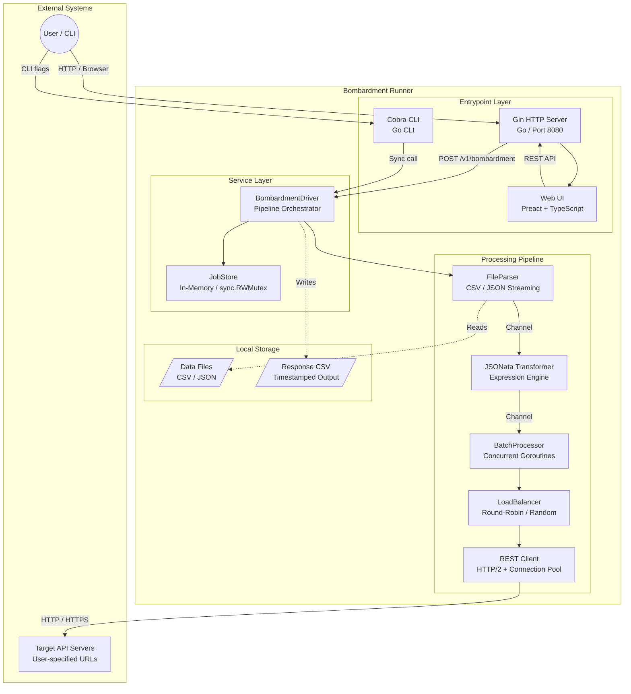
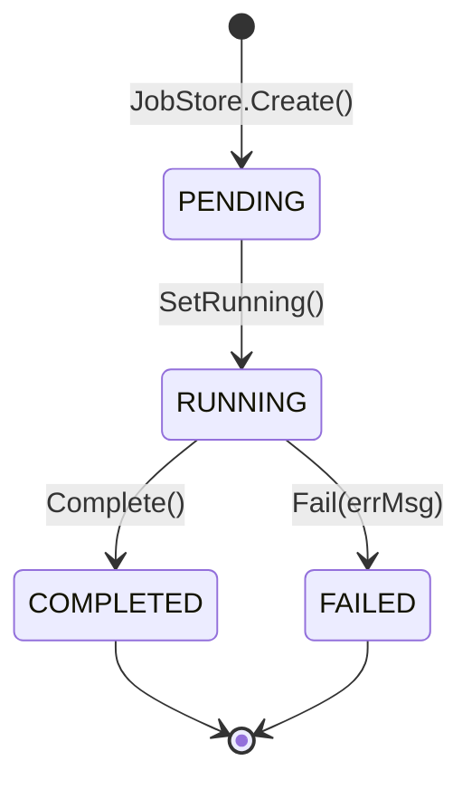

# Architecture: Bombardment Runner

Bombardment Runner is a lightweight, extensible tool for bulk API testing and data migration. It streams records from CSV/JSON files, transforms them via JSONata expressions, batches them, and dispatches HTTP requests concurrently across load-balanced targets. It runs as both a Gin HTTP server (with Preact Web UI) and a Cobra CLI.

## Architecture Classification

| Aspect | Finding |
| ------ | ------- |
| **Pattern** | Layered Monolith with Strategy Pattern extensibility |
| **Scale Category** | Small (<10K LOC) |
| **Maturity Level** | Production (CI/CD, Docker, health checks, graceful shutdown) |

## Technology Stack Summary

### Languages and Runtimes

- Primary: Go 1.23+ (`app/go.mod`)
- Frontend: TypeScript 5.5 / Preact 10.25 (`app/package.json`)

### Frameworks

- Backend: Gin (HTTP), Cobra (CLI)
- Frontend: Preact + Tailwind CSS 3.4 + esbuild
- ORM: Bun (present but inactive; in-memory store used)

### Infrastructure

- Container: Docker (multi-stage build: Node 20 + Go 1.23 + Alpine 3.20)
- Orchestration: Docker Compose (single service)
- Cloud: None (self-hosted / local)

### Data Stores

- Primary: In-memory `JobStore` (`sync.RWMutex` + `atomic` counters)
- Entity ORM: Bun with PostgreSQL dialect (defined but not wired)
- Cache: None
- Queue: None (Go channels for internal streaming)

## High-Level Architecture



> Diagram source: [`diagrams/container.mmd`](diagrams/container.mmd)

## Processing Pipeline

The core data flow follows a streaming pipeline architecture using Go channels for backpressure:

```text
File --> Parser (streaming via channels)
     --> Transformer (JSONata -> HTTP request)
     --> BatchProcessor (concurrent goroutines per batch)
     --> LoadBalancer (distributes across target URLs)
     --> ChannelClient (executes HTTP)
```

Each stage uses the **Strategy Pattern** with a common extension mechanism:

1. A `BaseStrategy[T]` generic interface (`services/base_strategy.go:4-7`)
2. A `Create*()` factory function switching on an enum from `models/enums/`
3. Concrete implementations in the same package

| Stage | Interface | Factory | Enum Values |
| ----- | --------- | ------- | ----------- |
| Parsing | `BaseFileParser[T]` | `CreateFileParser()` | CSV, JSON |
| Transforming | `BaseTransformer` | `CreateTransformer()` | JSONATA, ~~GOTEMPLATE~~ |
| Load Balancing | `BaseLoadBalancer` | `CreateLoadBalancer()` | ROUND_ROBIN, RANDOM, ~~LEAST_CONNECTION~~ |
| Client | `BaseChannelClient` | `CreateChannelClient()` | REST, ~~GRPC~~, ~~KAFKA~~ |

Struck-through values are defined as enums but not yet implemented.

> Component diagram: [`diagrams/component/pipeline-services.mmd`](diagrams/component/pipeline-services.mmd)

## Critical Flow: Bombardment Job Execution (P0)

The primary flow covers async job creation via the API and the full pipeline execution:

1. **User** sends `POST /v1/bombardment` with a `BombardmentRequest` payload
2. **Controller** validates input (batch size > 0, URLs non-empty, file source provided, no path traversal)
3. **JobStore** creates a new `Job` in PENDING state with a UUID
4. **Driver** launches a goroutine with panic recovery, transitions job to RUNNING
5. **Parser** opens the file and streams records via a Go channel
6. **Counter goroutine** wraps the channel, sampling `SetTotal` every 100 rows for progress tracking
7. **BatchProcessor** collects records into batches of size N, fans out goroutines per item
8. Each goroutine: **Transformer** evaluates JSONata expressions, **LoadBalancer** selects URL, **RESTClient** executes HTTP
9. `WaitGroup.Wait()` enforces batch boundaries before the next batch starts
10. Responses are collected and optionally written to a timestamped CSV (flushed every 100 rows)
11. Job transitions to COMPLETED or FAILED

User can poll `GET /v1/bombardment/:id` for real-time progress (`ProgressPercent` computed from atomic counters).

> Sequence diagram: [`diagrams/flow/bombardment-pipeline.mmd`](diagrams/flow/bombardment-pipeline.mmd)
> Transformation flow: [`diagrams/flow/bombardment-pipeline-transformations.mmd`](diagrams/flow/bombardment-pipeline-transformations.mmd)

## Job Lifecycle State Machine



- **PENDING**: Created with UUID, `CreatedAt` set
- **RUNNING**: Atomic counters track `processed`, `failed`, `total`; progress computed as `(processed + failed) / total * 100`
- **COMPLETED**: `CompletedAt` timestamp set
- **FAILED**: `ErrorMessage` and `CompletedAt` stored

> Full state diagram: [`diagrams/flow/job-lifecycle.mmd`](diagrams/flow/job-lifecycle.mmd)

## Concurrency Model

| Mechanism | Purpose | Evidence |
| --------- | ------- | -------- |
| `sync.RWMutex` | Thread-safe job store read/write | `services/job_store.go:119` |
| `sync.Mutex` | Job status transitions, LB index rotation | `services/job_store.go:46`, `load_balancing/round_robin_load_balancer.go:21` |
| `atomic.Int64` | Lock-free progress counters (processed, failed, total) | `services/job_store.go:43-45` |
| `sync.WaitGroup` | Batch boundary synchronization | `services/batching/batching.go:52-65` |
| Buffered channels | Backpressure between parser and batch processor | `services/driver/driver.go:226` |
| Goroutines per batch item | Concurrent HTTP execution within a batch | `services/batching/batching.go:57-62` |

## API Surface

| Method | Path | Handler | Purpose |
| ------ | ---- | ------- | ------- |
| GET | `/v1/ping` | `HealthController.Ping` | Health check (returns `{"message": "pong"}`) |
| POST | `/v1/bombardment` | `BombardmentController.Bombard` | Create async bombardment job |
| GET | `/v1/bombardment/:id` | `BombardmentController.GetJobStatus` | Get single job progress |
| GET | `/v1/bombardment` | `BombardmentController.ListJobs` | List all jobs (newest first) |
| GET | `/swagger/*any` | Swagger UI | Auto-generated API docs |
| GET | `/` | Static file | Web UI (Preact SPA) |
| GET | `/static/*` | Static files | CSS, JS, fonts, icons |

## Data Model

The system uses two parallel data models:

- **In-memory `Job`** struct with atomic counters for real-time progress tracking (`services/job_store.go:36-47`)
- **Bun ORM `JobEntity`** mapped to a `jobs` PostgreSQL table (`models/entities/job_model.go:9-18`), present but not currently wired

> Entity diagram: [`diagrams/data-model/erd.mmd`](diagrams/data-model/erd.mmd)

## Web UI Architecture

The frontend is a Preact single-page application bundled with esbuild:

| Layer | Technology | Evidence |
| ----- | ---------- | -------- |
| Framework | Preact 10.25 (lightweight React) | `app/package.json` |
| Language | TypeScript 5.5 (strict mode) | `app/tsconfig.json` |
| Styling | Tailwind CSS 3.4 with CSS variables | `app/tailwind.config.js` |
| Bundler | esbuild (ESM, ES2022 target) | `app/package.json` scripts |
| Fonts | IBM Plex Sans + JetBrains Mono | Self-hosted in `/static/fonts/` |
| Icons | Lucide SVG sprite | `/static/icons/` |

State management uses Preact contexts: `RouterContext`, `ThemeContext`, `WizardContext`, `JobFormContext`.

Bundle size budgets enforced in CI: CSS 32KB, JS 55KB, Icons 12KB (`Makefile:48-59`).

## Infrastructure

### Docker Multi-Stage Build

| Stage | Base Image | Purpose |
| ----- | ---------- | ------- |
| 1: Frontend | `node:20-alpine` | npm ci, Tailwind CSS + esbuild bundling |
| 2: Builder | `golang:1.23-alpine` | CGO_ENABLED=0, `-ldflags="-s -w"` |
| 3: Runtime | `alpine:3.20` | Non-root `appuser`, health check on `/v1/ping` |

### Docker Compose

- Port: 8080
- Volumes: `./data:/app/data`, `./responses:/app/responses`
- Resources: 2 CPUs / 1GB limit, 0.5 CPU / 256MB reservation
- Security: `no-new-privileges:true`
- Logging: json-file, 10MB max, 3 file rotation

### CI/CD (GitHub Actions)

| Job | Dependencies | Purpose |
| --- | ------------ | ------- |
| `lint` | None | golangci-lint |
| `test` | None | `go test -race -coverprofile` |
| `ui-bundle-check` | None | Bundle size budget enforcement |
| `build` | lint, test, ui-bundle-check | Frontend + Go binary build |
| `docker` | lint, test | Docker image build |

> Infrastructure diagram: [`diagrams/infrastructure/deployment.mmd`](diagrams/infrastructure/deployment.mmd)

## Architecture Quality Assessment

| Dimension | Score | Evidence |
| --------- | ----- | -------- |
| **Modularity** | 4/5 | Strategy pattern with clean interfaces and factories. Each pipeline stage is independently extensible. Enums define extension points. Minor coupling: factory switch must stay in sync with enums. |
| **Scalability** | 3/5 | Concurrent goroutines per batch with configurable batch size. Connection pooling (100 idle conns). Single-instance only; in-memory job store prevents horizontal scaling. |
| **Testability** | 4/5 | Interface-driven design enables mock injection. Race detector in CI. Generic `BatchProcessor[T, R]` is independently testable. |
| **Observability** | 3/5 | Structured logging via `zap` (production logger). Real-time progress via atomic counters. No metrics export (Prometheus/OpenTelemetry), no distributed tracing. |
| **Security Posture** | 4/5 | Security headers (X-Content-Type-Options, X-Frame-Options, Referrer-Policy, Permissions-Policy). Path traversal validation. Non-root Docker user. `no-new-privileges`. CORS configurable via env. `InsecureSkipVerify` flag is opt-in. |

## Risk and Technical Debt

### High Priority

- [ ] **In-memory job store**: Jobs are lost on restart. No persistence layer active despite Bun ORM entities existing. Evidence: `services/job_store.go:118` uses `map[string]*Job`.
- [ ] **No job cleanup**: Jobs accumulate indefinitely in memory with no TTL or eviction. Evidence: `JobStore` has no `Delete()` or cleanup method.

### Medium Priority

- [ ] **Unimplemented strategies**: GRPC, KAFKA client channels; GOTEMPLATE transformer; LEAST_CONNECTION load balancer are defined as enums but have no implementations. Factory defaults return errors. Evidence: `models/enums/client_channels.go:7-8`, `transformer_strategy.go:7`.
- [ ] **No rate limiting**: API has no rate limiting on job creation. Each `POST /v1/bombardment` spawns an unbounded goroutine. Evidence: `controllers/bombardment_controller.go:69-70`.
- [ ] **No metrics export**: No Prometheus/OpenTelemetry integration for production monitoring. Logging only via zap.

### Low Priority

- [ ] **ORM entity mismatch**: `JobEntity` has different fields than the in-memory `Job` (e.g., `JobName`, `JobDescription`, `IsActive`). When persistence is added, migration will require reconciliation. Evidence: `models/entities/job_model.go` vs `services/job_store.go`.
- [ ] **Single-host only**: No clustering, no shared state, no leader election. Acceptable for the current use case but limits deployment options.
- [ ] **No request body size limit**: Large file uploads via `file_content_b64` could exhaust memory. Gin's default body limit applies but is not explicitly configured.

## Decision Log

| ID | Decision | Status |
| -- | -------- | ------ |
| [0001](decisions/0001-strategy-pattern.md) | Strategy Pattern for Pipeline Extensibility | Discovered |

## Cross-Cutting Concerns

### Security

- Security headers applied as Gin middleware (`bootstrap/bootstrap.go:92-98`)
- CORS configurable via `CORS_ORIGINS` env var (`bootstrap/bootstrap.go:101-112`)
- Path traversal validation on response storage paths (`controllers/bombardment_controller.go:92-94`, `driver/driver.go:141-145`)
- Non-root Docker container with `no-new-privileges` (`Dockerfile:22-23,27`)
- Panic recovery middleware logs internally, returns generic error to client (`bootstrap/bootstrap.go:79-89`)

### Error Handling

- Controller: JSON error responses with validation details
- Driver: Panic recovery in async goroutine, job marked FAILED with error message
- Pipeline: Each stage returns errors that propagate to job failure
- File I/O: Deferred `Close()` with error logging (`driver/driver.go:302-306`)

### Logging

- `go.uber.org/zap` production logger, globally replaced at startup (`main.go:15-16`)
- Structured fields: job_id, error, path, method
- Debug-level request logging in REST client
